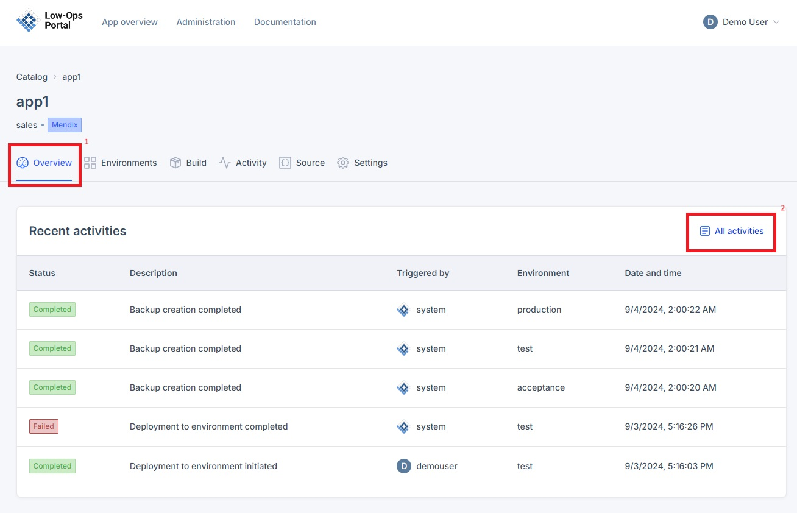
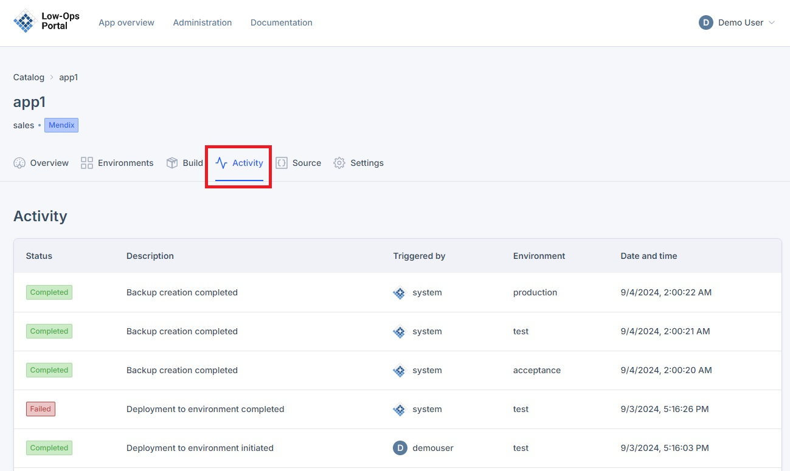

# Activity 

This document explains the Low-Ops Platform Activity and how to access it.

## Overview

Activity tab is designed for recording events and actions within the system for the purpose of:
- Monitoring
- Analyzing
- Ensuring accountability

It captures information about activities such as:
- Application onboarding
- Application configuration changes
- Data backups and restore actions
- Application pipeline triggers on commits to repository
- Other significant events within the platform or applications

## Accessing Activity tab

1. Select an application from the list and click on it to open.  
2. You will be redirected to the "Overview" tab which shows the recent activity. 

3. To access the full activities list, you have two options:
   a. Click on "All activities" in the right corner of the Overview tab.
   b. Navigate to the "Activity" tab.

4. In the Activities section, you will find the following information for each audit log event:
   - Status
   - Description
   - Triggered by
   - Environment
   - Date and time

> **Note:** Regular review of Activity can help maintain security, track changes, and ensure compliance with organizational policies.