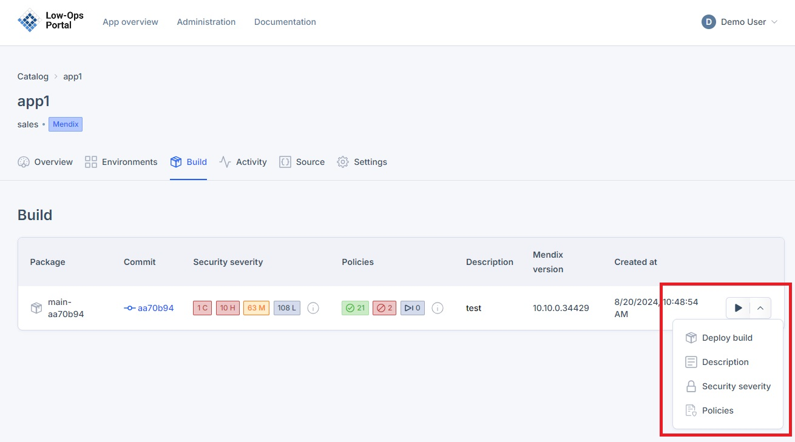
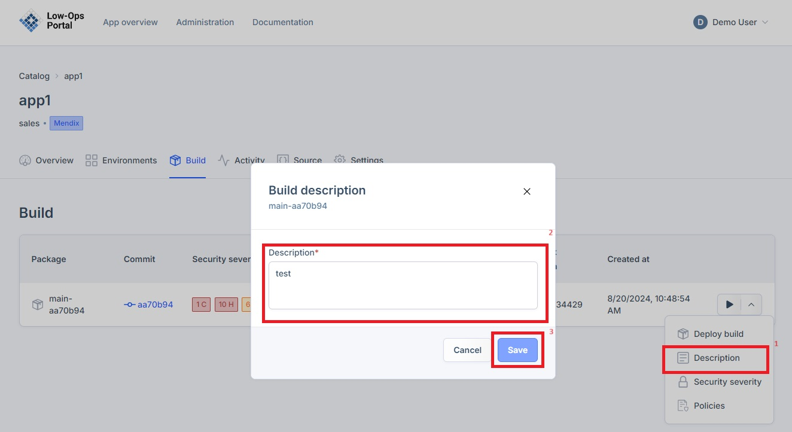

# Build Management

This document provides instructions on how to access and understand the "Build" tab.

## Overview

The Build page allows you to view and manage build versions, providing insight into your application's development history and enabling you to track changes over time.

## Accessing the Build Tab

1. From the "Home" page, select an application.
2. Navigate to the "Build" tab.

## Understanding Build Components

The Build tab contains several key components:

1. Package: Indicates the package name
2. Commit: Indicates the Commit name
3. Security Severity: Identifies and categorizes potential security issues within each build

> **Note:** To learn more about the security report, refer to the [Security Report tutorial](../security-report.md).

4. Policies: Pre-defined rules that validate Mendix app development against best practices

> **Note:** To learn more about the policies, refer to the [Code Quality tutorial](../code-quality.md).

5. Description: Indicates the name of the environment
6. Mendix Version: Shows the version of Mendix used
7. Created At: Date and time when the application was created

## Making Adjustments

To access additional options:

1. Click the arrow to open the menu

2. In this menu, you can:
   - Deploy the application
   > **Note:** To learn how to deploy an application, refer to the [Deploy tutorial](/deploy.md).
   - Modify the "Description"
   - Open the Security Severity details
   - Open the Policies details

### Modifying the Description

1. Click on "Description"
2. In the pop-up window, adjust the description
3. Click the save button

> **Tip:** Regularly review and update build descriptions to maintain clear documentation of your application versions.