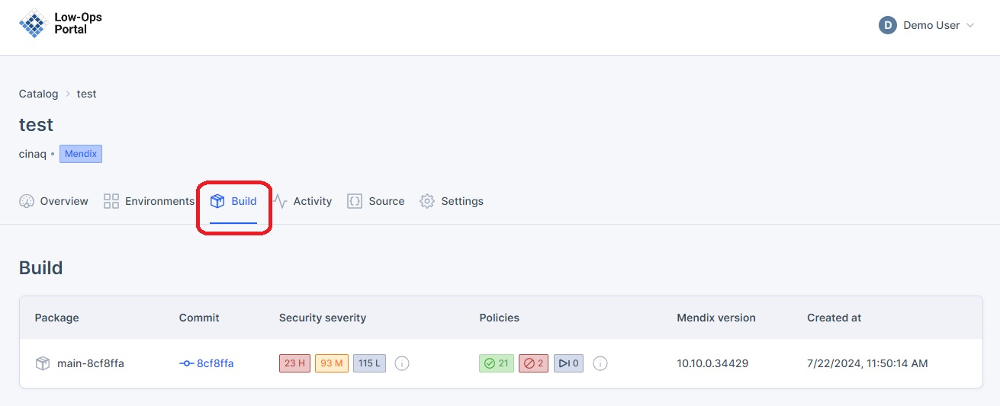
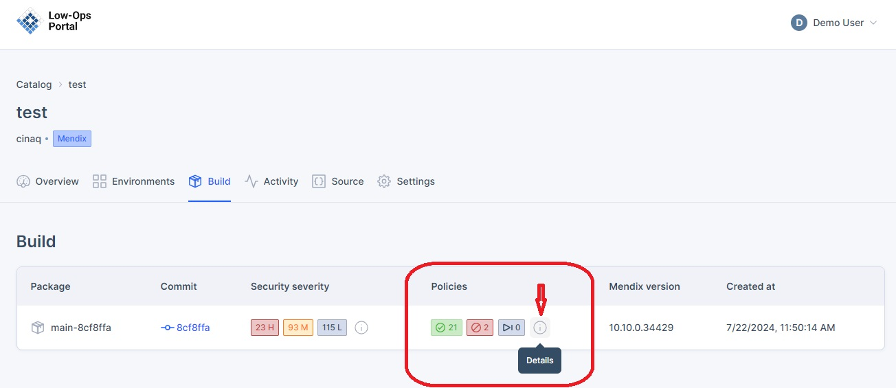
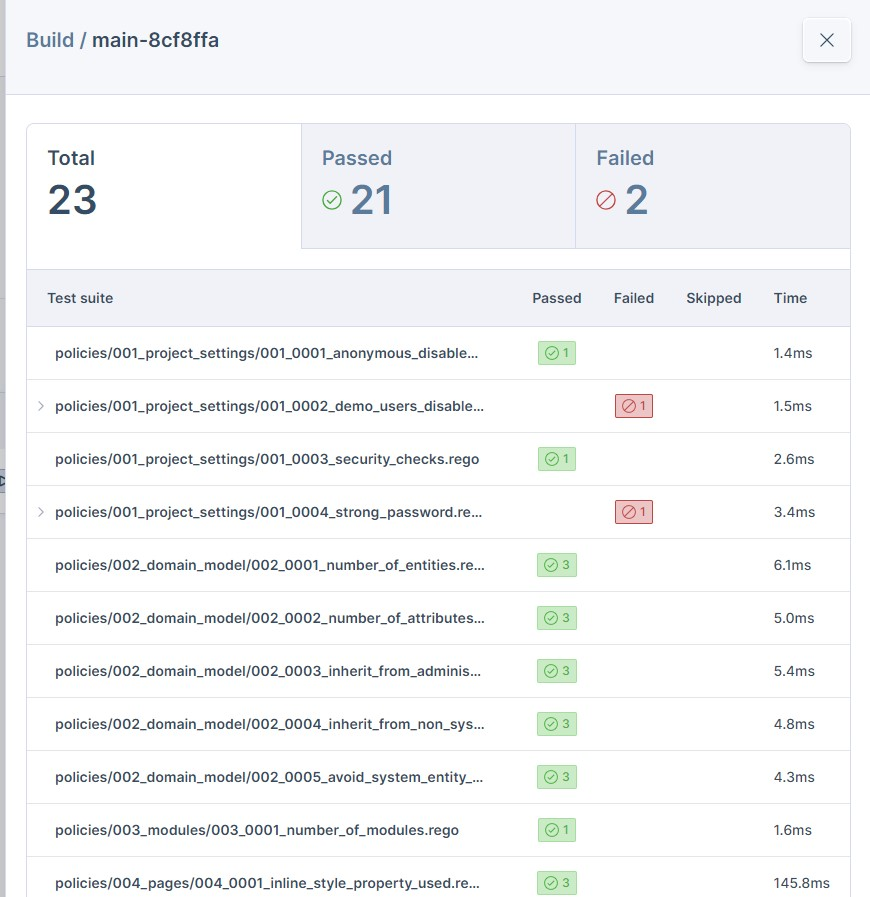
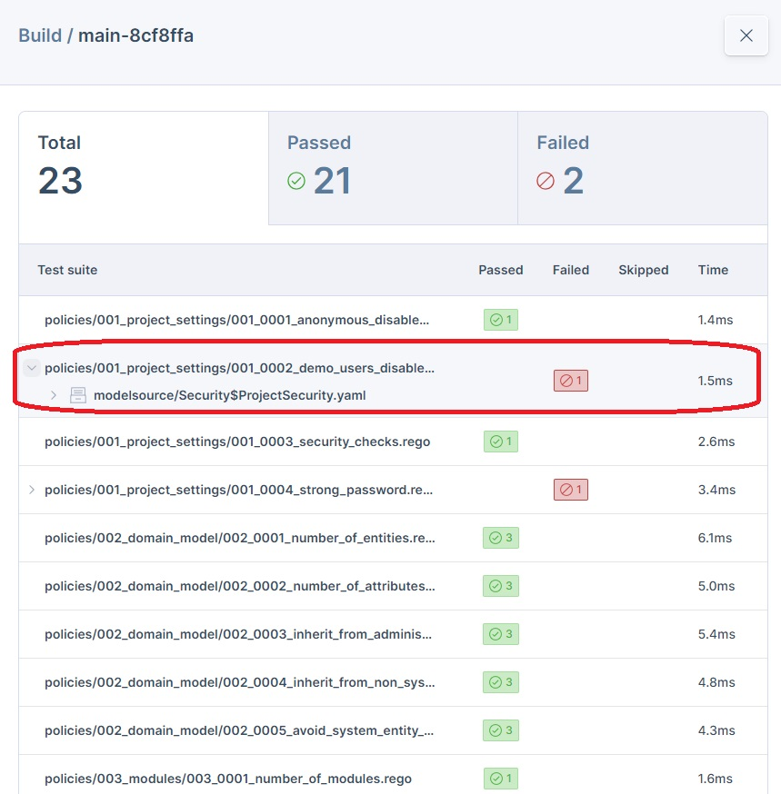

## *Build*

*This section covers the build versions of your Mendix applications.The Build page allows you to view and manage these versions, providing insight into your application's development history and enabling you to track changes over time.*

**To access the `Build` tab, follow the steps below:**

- Navigate to the `Home` page and open one of the applications.

- Inside the app, navigate to the `Build` tab. 

## *Security Severity*

*The Security Severity feature helps identify and categorize potential security issues within each build, allowing to address vulnerabilities promptly.*

- By clicking the `Details`, you can access more comprehensive information about the security issues detected in a specific build.

- When opening the Details, you will see a summary of security vulnerabilities categorized by severity (High, Medium, Low), along with a table listing specific vulnerabilities including their CVE IDs, affected packages, versions, and fixed versions.

## *Policies*

*Policies are a set of pre-defined rules that validate Mendix app development against best practices.*

- By clicking the `Details`, you can access more comprehensive information about the Policies.

- When opening the Details, you will see a summary of policy test results, including the total number of tests, passed tests, and failed tests.

- To view details of the failed policies, simply click the arrow as shown in the screenshot.

