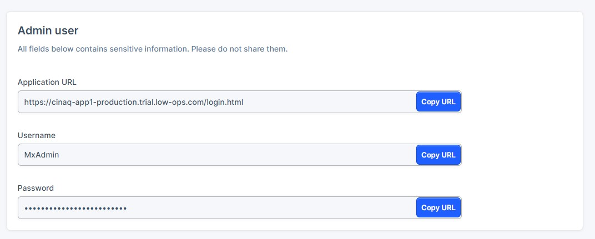
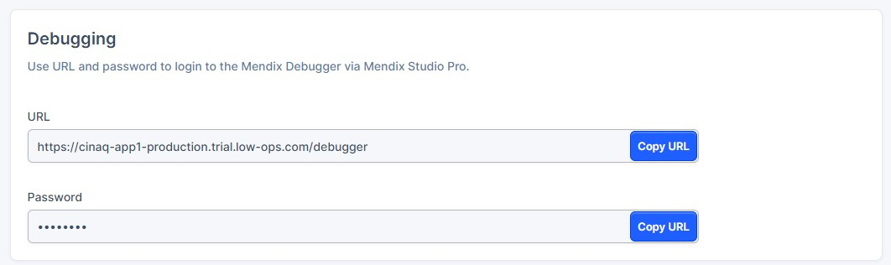

# Security Access Guide

This document provides instructions on how to access the Access tab and retrieve login credentials for Mendix Studio Pro and Mendix Debugger.

## Accessing the tab
There is one way to access the Security tab:

1. From the homepage:
- Choose one of the applications from the list.
- Select one of the environments: `Test`, `Acceptance`, or `Production`.
- In the left-side menu, select `Security`.

## Retrieve Login Credentials

### Mendix Studio Pro Access
To access Mendix Studio Pro:

- Locate the `Admin User` section.
- Find the URL and login credentials for Mendix Studio Pro.

### Mendix Debugger Access
To access the Mendix Debugger:

- Locate the `Debugging` section.
- Find the URL and password to log in to the Mendix Debugger via Mendix Studio Pro.

> **_NOTE:_** Ensure you keep these credentials secure and do not share them with unauthorized individuals.