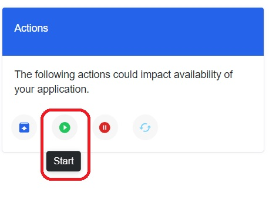
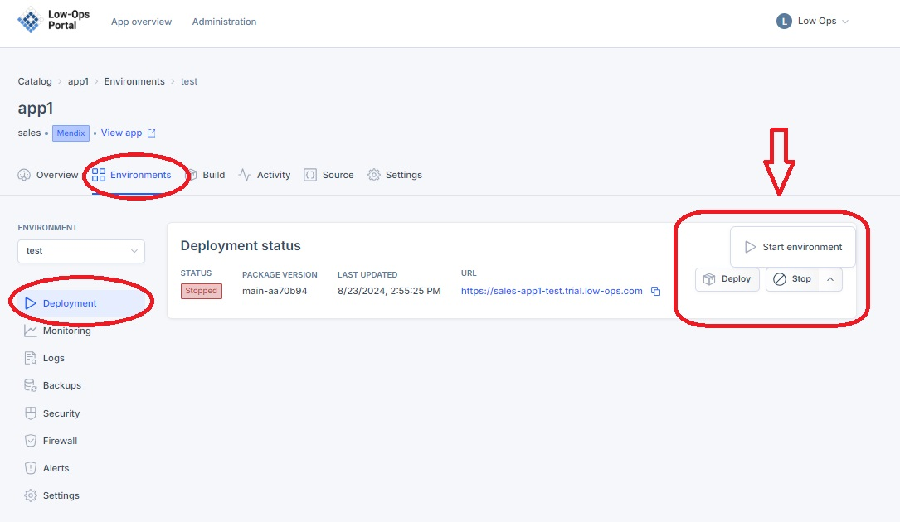
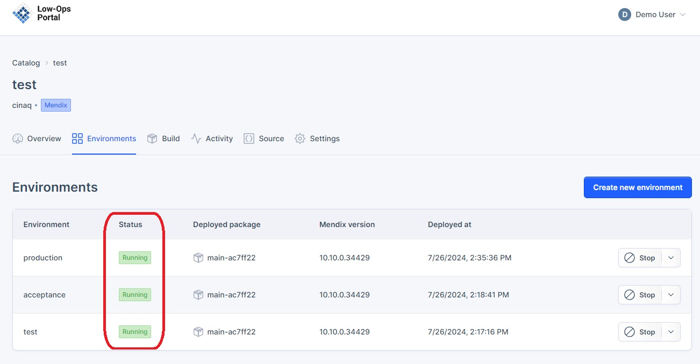
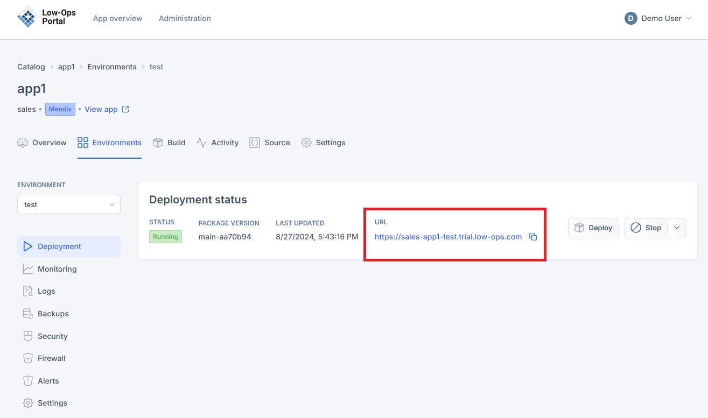
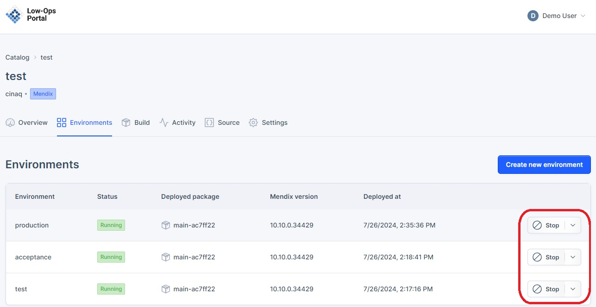
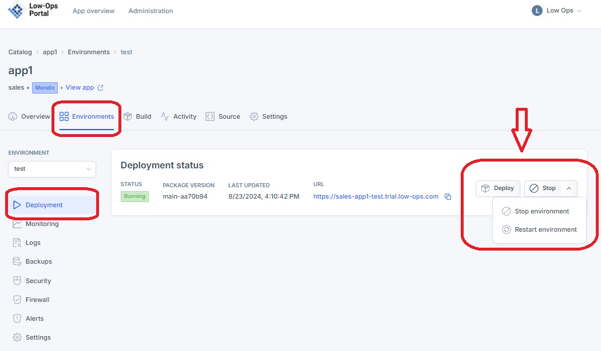
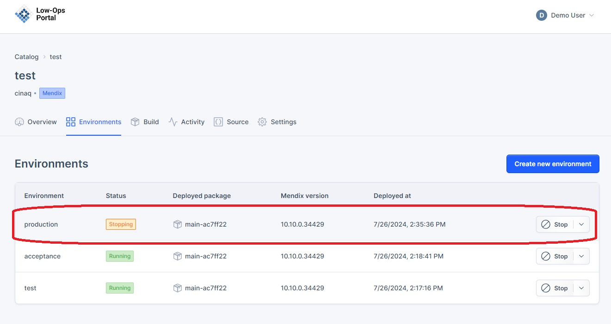
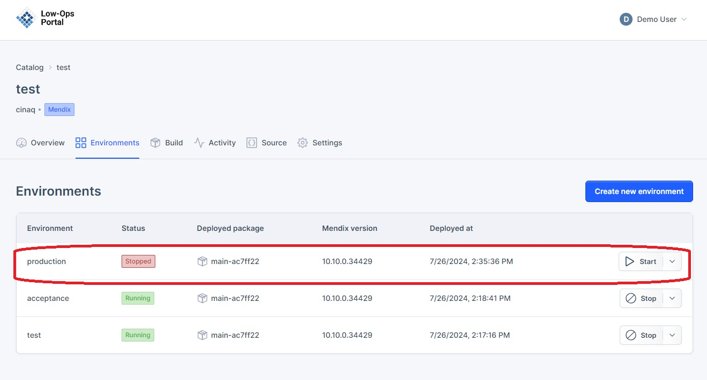
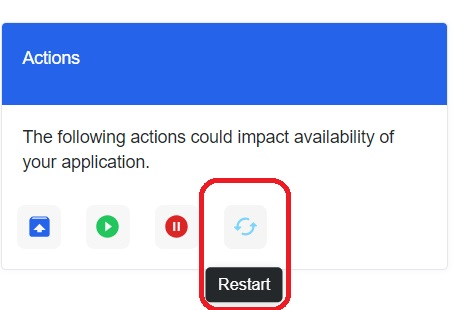
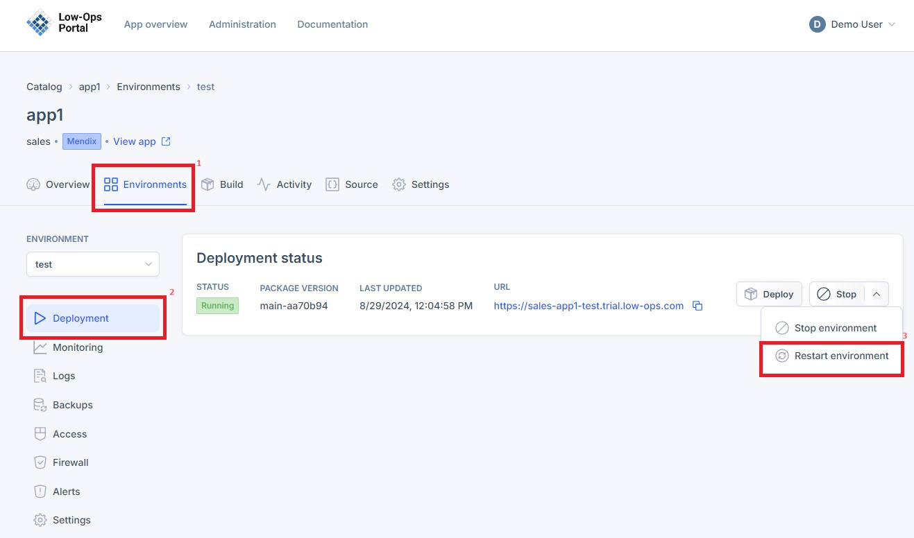

# Application Management Guide

This document provides instructions on how to Start, Stop, and Restart the application in different environments.

## Start the Application

### Accessing the Start button

There are two ways to access the Start button:

1. From the Environments page:  
   - Navigate to the Environments tab.
   - Click the Start button next to the specific environment (See Figure 1).

2. From the Deployment page:
   - Open a specific environment.
   - You will be redirected to the Deployment page.
   - Locate the Start button on this page (See Figure 2).

**Figure 1: Start button on Environments page**

**Figure 2: Start button on Deployment page**

### Starting the application 

1. Click the Start button for the desired environment.
2. The status will change to "Starting.
3. Wait for 1-2 minutes while the application initializes.
4. The status will change to "Running" once the application has started (See Figure 3).
  

5. Click the provided URL to verify that the application opens successfully (See Figure 4).
  

**Figure 3: Running status**

**Figure 4: Open application**

## Stop the Application

### Accessing the Stop Button

The Stop button is located in the same place as the Start button. There are two ways to access it:

1. From the Environments page:
   - Navigate to the Environments tab.
   - Click the Stop button next to the specific environment (See Figure 6).

2. From the Deployment page:
   - Open a specific environment.
   - You will be redirected to the Deployment page.
   - Locate the Stop button on this page (See Figure 7).

**Figure 6: Stop button on Environments page**

**Figure 7: Stop button on Deployment page**

### Stopping the Application

1. Click the Stop button for the desired environment.
2. The status will change to "Stopping" (See Figure 8).
3. Wait for the application to fully stop.
4. The status will change to "Stopped" once the application has been terminated.
5. Attempting to access the URL should result in a "503 Service Temporarily Unavailable" error message (See Figure 9).

**Figure 8: Stopping status**

**Figure 9: Stopped status and error message**

## Restart the Application

### Accessing the Restart button

The Restart button is located in the same place as the Start and Stop button. There are two ways to access it:

1. From the Environments page:
   - Navigate to the Environments tab.
   - Click the arrow to access drop down menu and see access the Restart button (See Figure 10).

2. From the Deployment page:
   - Open a specific environment.
   - You will be redirected to the Deployment page.
   - Locate the Restart button by clicking the arrow and accessing the Restart button (See Figure 11).

**Figure 10: Restart button on Environments page**

**Figure 11: Restart button on Deployment page**

## Restarting the Application

1. Click the Restart button for the desired environment.
2. The status will change to "Restarting".
3. Wait for 1-2 minutes while the application initializes.
4. The status will change to "Running" once the application has restarted.
5. Click the provided URL to verify that the application opens successfully.