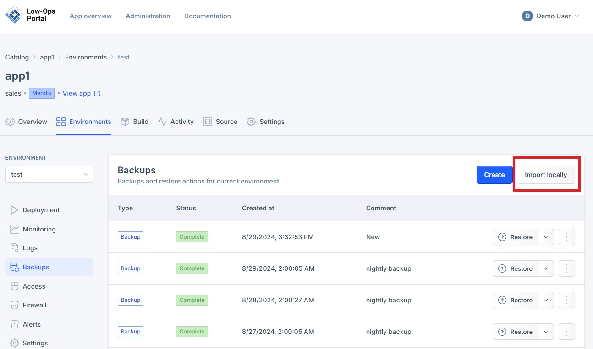
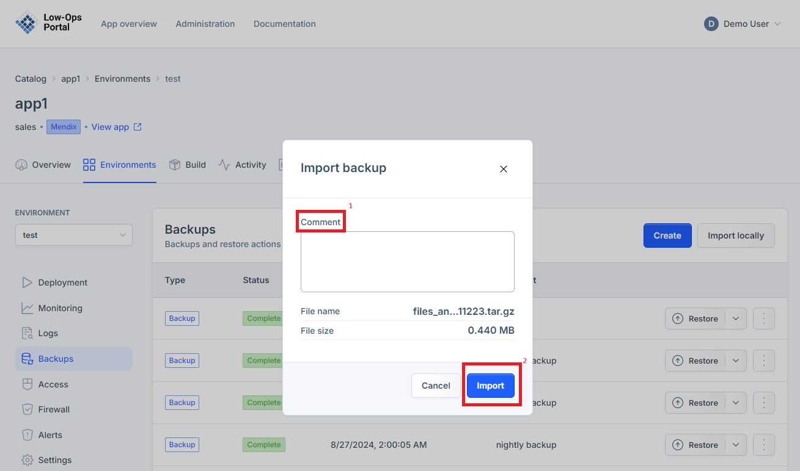

# Import a backup

This document provides instructions on how to import backups in different environments. Backups serve as essential data insurance, ensuring quick recovery and minimal operational overhead in the face of data loss or system failures.

## Accessing the Backups tab

1. Navigate to the Environments tab.

2. Choose the desired environment from the list.
3. A new dropdown navigation menu will appear.
4. In the left-side menu, select "Backups".

## Importing a Backup

1. Click the "Import locally" button in the right corner.

2. Upload the backup file from your device in the tar.gz archive format.
3. In the pop-up window include a comment and click the "Import" button. 

3. Once the file is loaded, it will appear as the first backup in the list of backups.  
