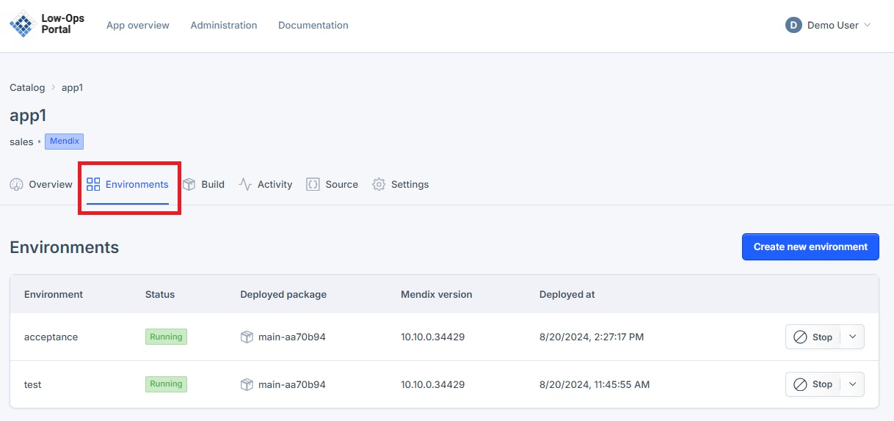
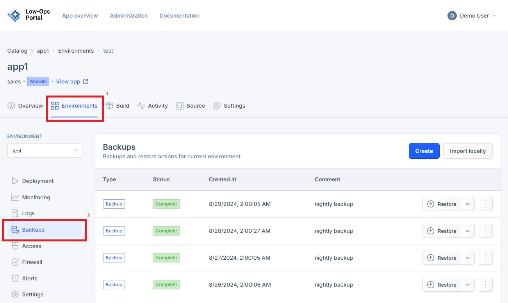
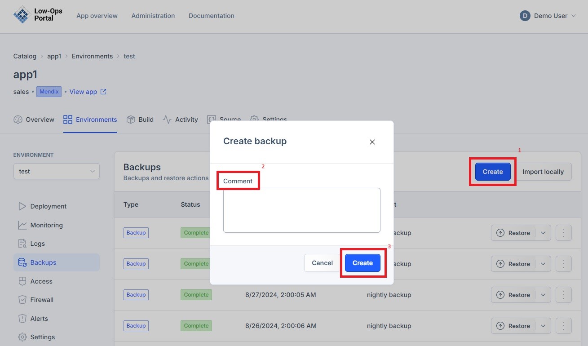
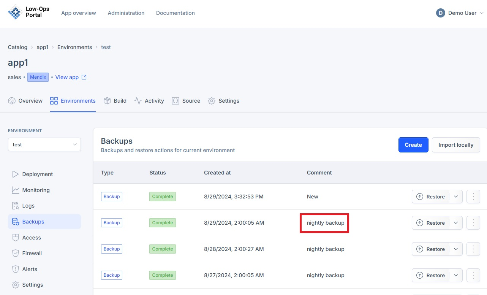
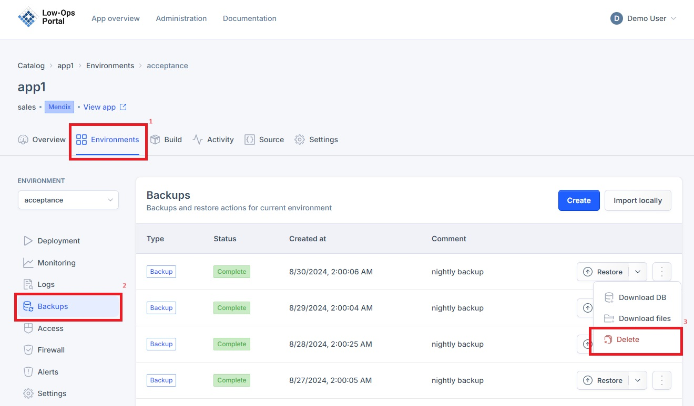
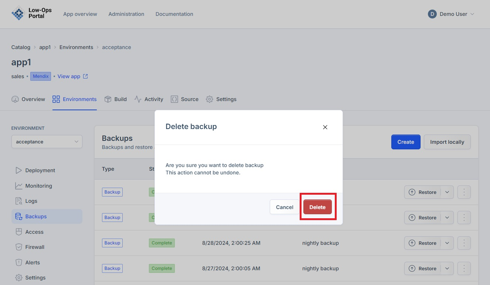

# Manage backups

This document provides instructions on how to create and delete backups in different environments. Backups serve as essential data insurance, ensuring quick recovery and minimal operational overhead in the face of data loss or system failures.

## Accessing the Backups tab

1. Navigate to the Environments tab.

2. Choose the desired environment from the list.
3. A new dropdown navigation menu will appear.
4. In the left-side menu, select "Backups".

## Creating a Backup

1. Click the "Create" button in the right corner. 

2. In the pop-up window:
    - Include a comment
    - Click the "Create" button
3. The newly created backup will appear in the list of backups

## Nightly Backup

The system automatically creates a backup at night. These backups appear with the "Nightly backup" comment in the list of backups.

## Deleting a backup

1. Click on the arrow drop down list next to the "Restore" button in the right corner.

2. Click on the "Delete" button 

3. In the pop up window, click the "Delete" button to confirm the deletion of the backup. 

