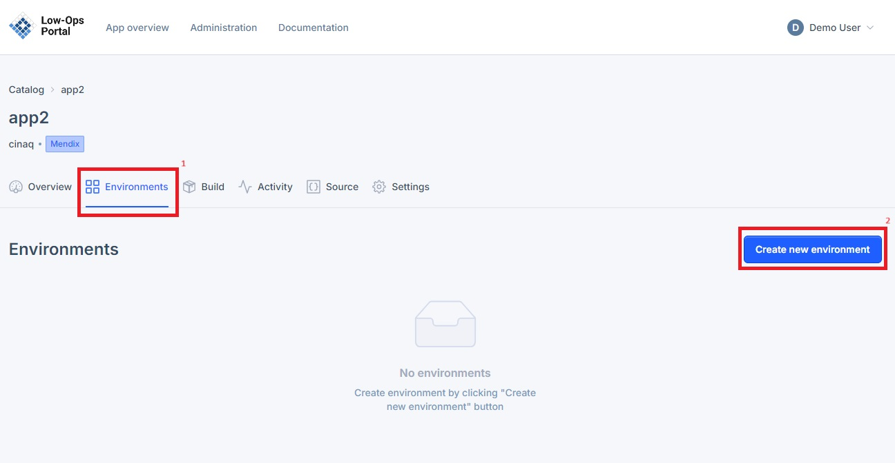
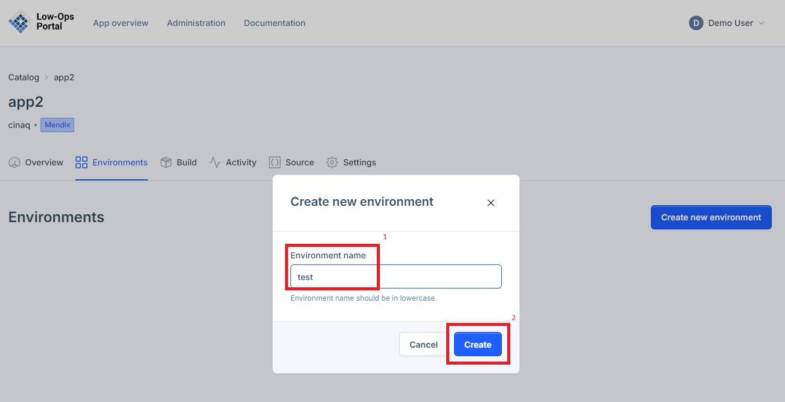
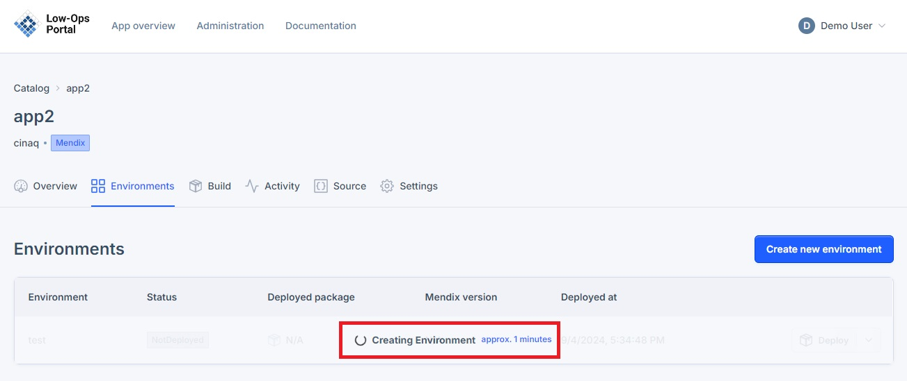

# New Environment

This documentation provides a step by step guide on how to create new environments.

## Creating new environment

1. Navigate to the Environments tab.

2. Click the "Create new environment" button.

3. In the pop up window, indicate environment name and click the "Create" button. 

4. Allow a couple of minutes for the environment to create. 

5. Once the environment is created, it will appear in the list of environments. 

> **_NOTE:_** To learn how to deploy an application in the created environment, follow the steps from the [Deploy tutorial](/deploy.md).