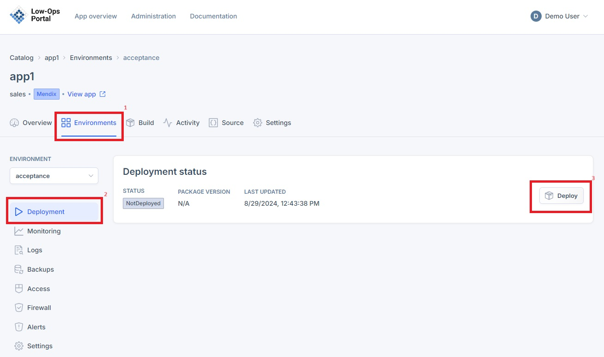

# Application Deployment Guide

This document provides instructions on how to deploy the application in different environments.

## Deploy the Application

> **_NOTE:_** The following steps are the same for Test, Acceptance and Production environments.

### Accessing the Deploy button

There are two ways to access the Deploy button:

1. From the Environments page:  
   - Navigate to the Environments tab.
   - Click the Start button next to the specific environment.

2. From the Deployment page:
   - Open a specific environment.
   - You will be redirected to the Deployment page.
   - Locate the Start button on this page.

### Deploying the Application

1. Once the "Deploy" button is clicked, a side menu will pop. 
   - Select the package version.
   - Configure Constants; You can include and modify new values as needed by clicking the pencil. 
   - Enable/Disable MyFirstModule.Cleanup.
   - Check the box for "I acknowledge the app might be offline briefly during deployment".
   - Click the "Deploy" button.

2. The status will change to "Deploying". 

3. Wait for 1-2 minutes while the application initializes.
4. The status will change to "Running" once the application is deployed.

5. Click the provided URL to verify that the application opens successfully.

