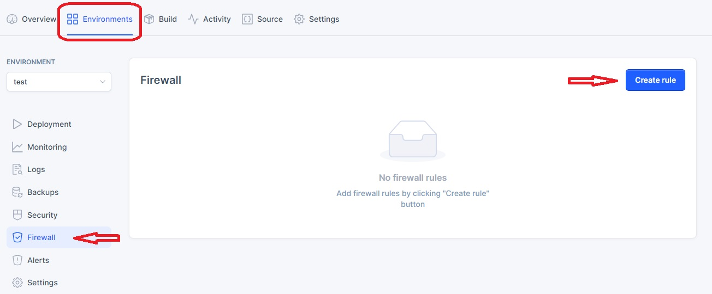
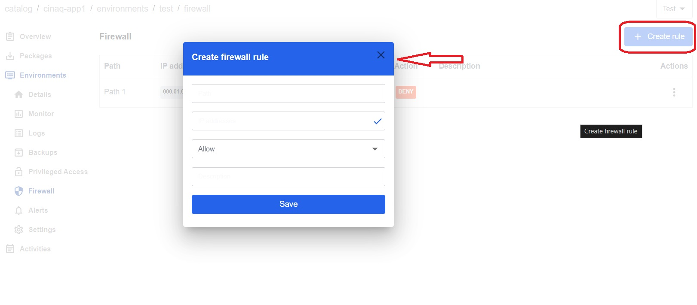
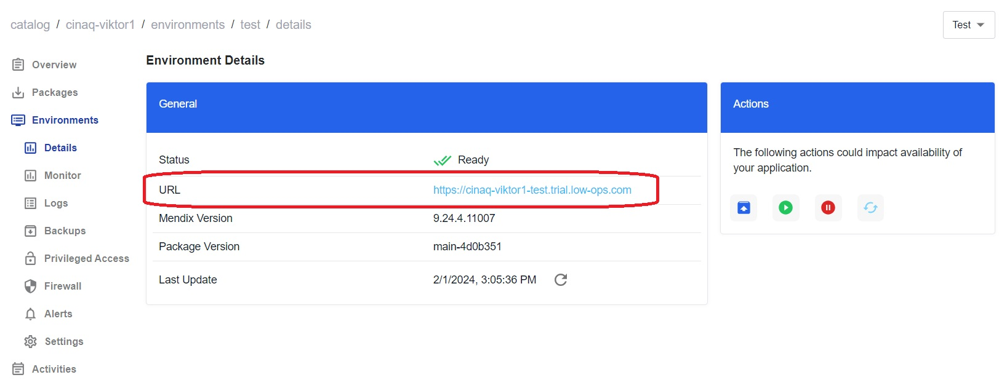
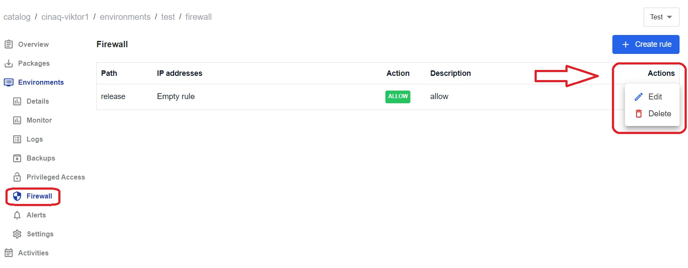
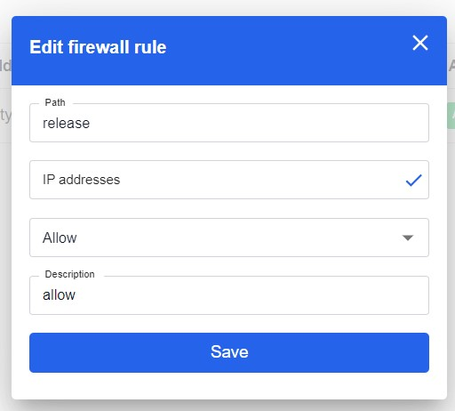

# Firewall Management

Firewall serves as a critical component for securing the network and systems.

## Accessing the Firewall Tab

1. Navigate to the Environments tab (See Figure 1).
2. Choose the desired environment from the list.
3. A new dropdown navigation menu will appear.
4. In the left-side menu, select Firewall.

**Figure 1: Environments overview**

## Creating a Firewall Rule

1. Click on the Create rule button in the upper right corner.
2. In the pop-up window, enter the rule details.
3. Click on the Create button.
4. Re-deploy the application by following the steps from the [Application Actions Tutorial](./application_actions.md).
5. From the Deployment tab, use the URL to log in to Mendix Studio Pro.
6. Verify that the created rule works as specified.

**Figure 2: Firewall tab**

**Figure 3: Create firewall rule**

**Figure 4: Mendix URL**

## Managing Firewall Rules

### Updating a Firewall Rule

1. Return to the Firewall tab.
2. Click on the three dots at the upper right corner of the rule you want to edit.
3. Click on the Edit button.
4. Update the firewall rule details in the pop-up window that appears.
5. Click Save to apply the changes.

### Deleting a Firewall Rule

1. Return to the Firewall tab.
2. Click on the three dots at the upper right corner of the rule you want to delete.
3. Click on the Delete button.
4. Confirm the deletion in the pop-up window.

**Figure 5: Manage firewall**

**Figure 6: Edit firewall**

