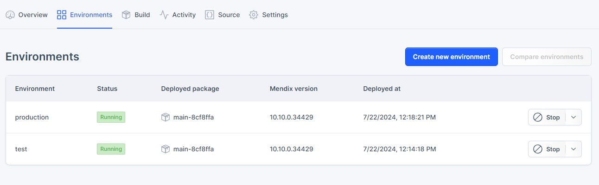
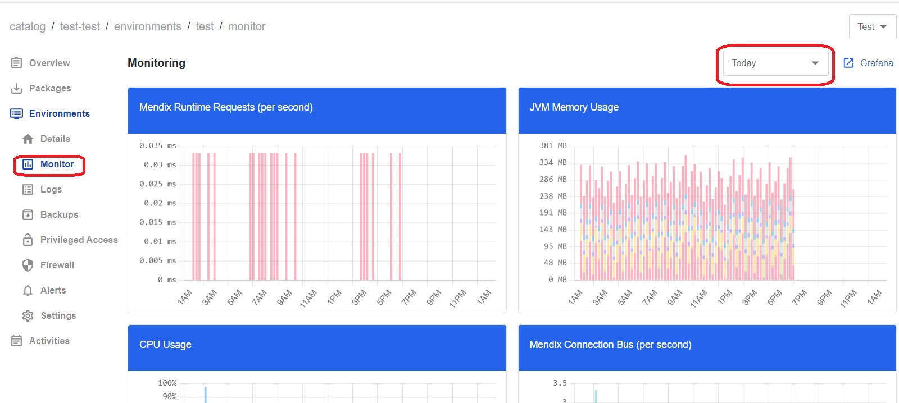
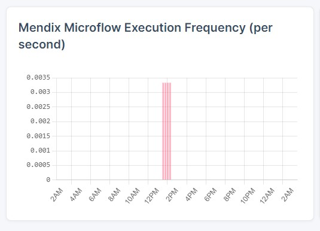
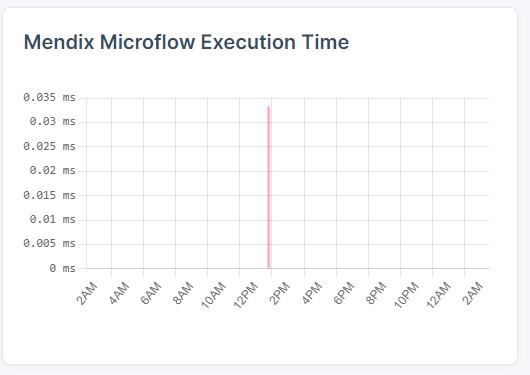
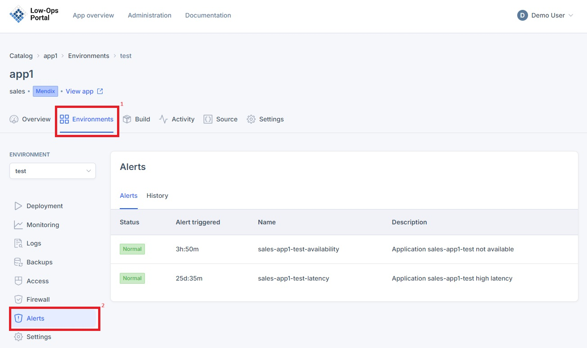

Monitoring is essential for proactively identifying and addressing system issues, ensuring performance, and maintaining overall reliability with minimal manual intervention.

**To access the `Monitor` tab, follow the steps below:**

- Navigate to the Environments tab and choose the environment from the list.

- Once one of the environments is selected, a new dropdown navigation menu will appear. 
- In the left-side menu, select `Monitor`.

- Select the period for which to display the metrics: `Today`, `24 hours`, `3 days`, `30 days`.

 **Microflow metrics - Mendix Microflow Execution Frequency**

Displays Mendix Microflow Executon Frequency (per second).

 **Microflow metrics - Mendix Microflow Execution Time**

Displays Mendix Microflow Execution Time.

## Alerts

Alerts serve as automated notifications that promptly inform operators about potential issues or deviations from normal behavior, enabling rapid response and resolution.

**To access the `Alerts` tab, follow the steps below:**

- Navigate to the Environments tab and choose the environment from the list.

- Once one of the environments is selected, a new dropdown navigation menu will appear. 
- In the left-side menu, select `Alerts`.

- The `State` column will notify if the application is running without problems or if any problems have occured.
