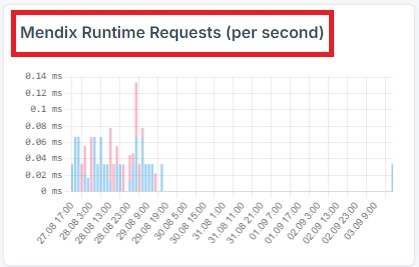
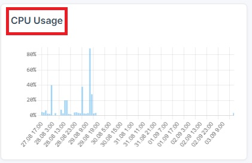
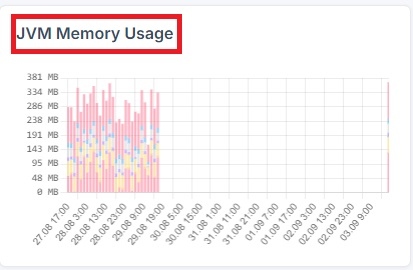
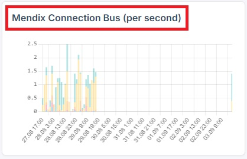

# Monitoring Guide

Monitoring is essential for proactively identifying and addressing system issues, ensuring performance, and maintaining overall reliability with minimal manual intervention.

## Access Monitoring Tab

   1. Navigate to the "Environments" tab.

   2. Choose the desired environment from the list.
   3. A new dropdown navigation menu will appear.
   4. In the left-side menu, select "Monitoring".

## Managing Monitoring tab

 Select the period for which to display the metrics: "3H", "12H", "24H", or "48H".

## Available Metrics

### Mendix Runtime Requests (per second)

### CPU Usage

### JVM Memory Usage

### Mendix Connection Bus

### Microflow Metrics - Mendix Microflow Execution Frequency

This metric displays Mendix Microflow Execution Frequency (per second).

### Microflow Metrics - Mendix Microflow Execution Time

This metric displays Mendix Microflow Execution Time.

