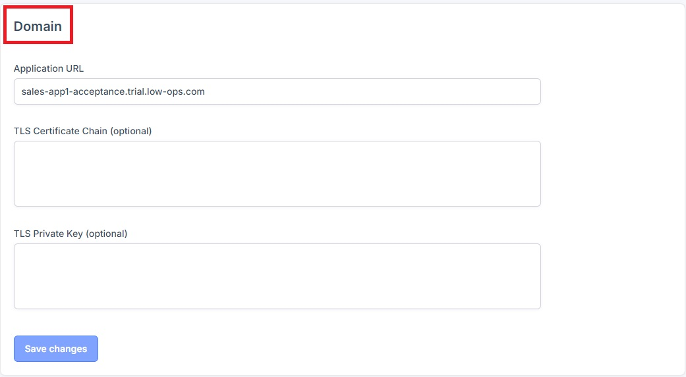
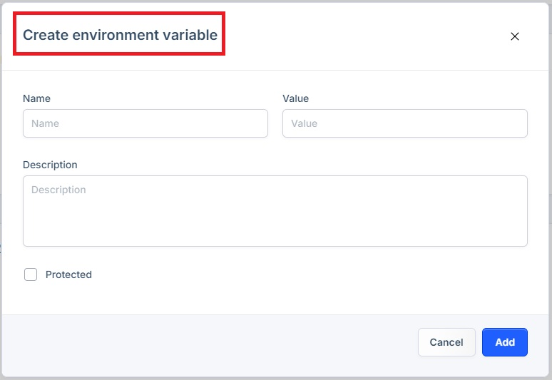

# Setting Configuration Guide

This document provides instructions on how to view and modify environment settings.

## Access Settings tab

1. Navigate to the "Environments" tab.

2. Choose the desired environment from the list.
3. A new dropdown navigation menu will appear.
4. In the left-side menu, select "Settings".

The Configuration page is divided into five sections: "Domain", "Scaling", "Environment Variables", "Runtime Settings", and "Delete this environment".

### "Domain" Section

This section consists of the "Application URL", and fields for "TLS Certificate Chain" and "TLS Private Key".

### "Scaling" Section

This section allows you to modify "Quotas CPU", "Quotas memory", and "Replicas".

To make changes:
  - Update the fields with desired changes.
  - Click the "Save changes" button.

### "Environment Variables" Section

This section allows you to add new environment variables.

To add a new variable:
1.  Click on the "Add" button in the right corner.
2. In the pop-up window:
  - Include the "Name", "Value", and "Description".
  - Check the "Protected" checkbox (optional).
  - Click on the "Add" button.

### "Runtime Settings" Section

This section allows you to add new runtime settings.

To add a new runtime settings:

1. Click on the "Add" button in the right corner.
2. In the pop-up window:
  - Include the "Name" and "Value".
  - Click on the "Add" button.

> **_NOTE:_** For the new setting values to take effect, re-deploy the application. Re-deploy the application by following the steps from the [Deploy Application Tutorial](deploy.md).

### Delete this environment Section

This section allows you to delete the environment and everything it contains.

To delete the environment, click  the red "Delete environment" button.

> **_WARNING:_** This action is irreversible. Ensure you want to delete the environment before proceeding.