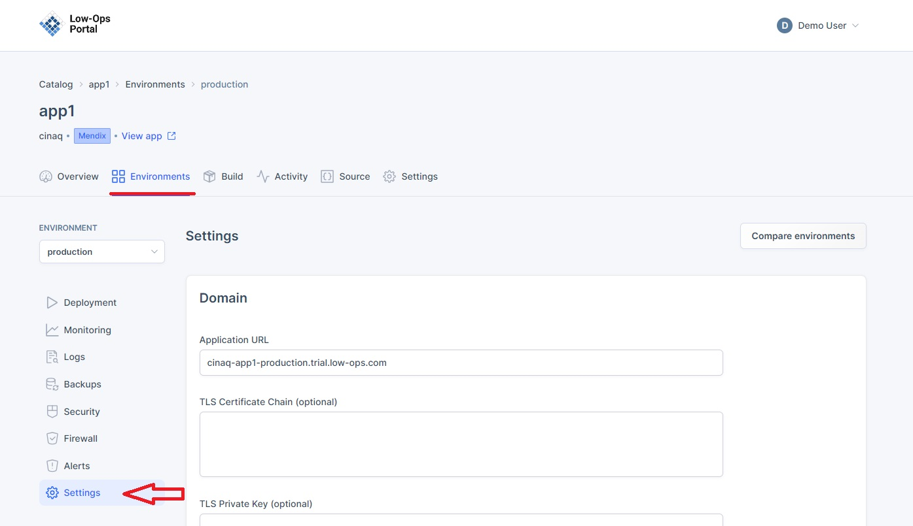
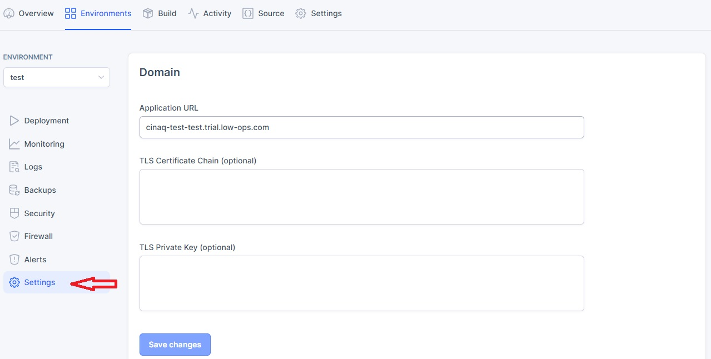
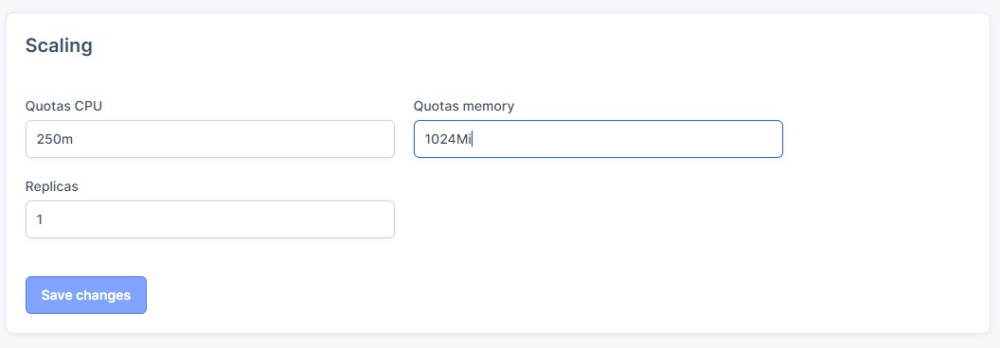
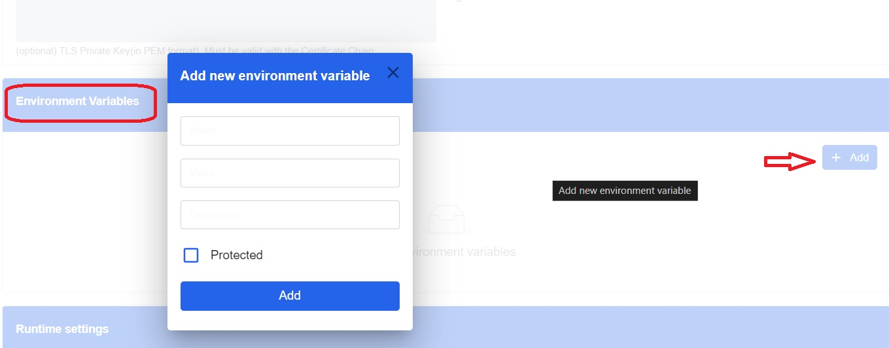
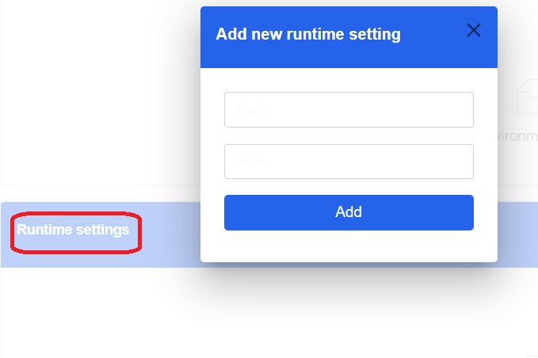
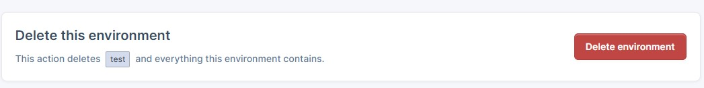

# Setting Configuration Guide

This document provides instructions on how to view and modify environment settings.

## Access Settings tab

1. Navigate to the "Environments" tab.

2. Choose the desired environment from the list.
3. A new dropdown navigation menu will appear.
4. In the left-side menu, select "Settings".

The Configuration page is divided into five sections: `Domain`, `Scaling`, `Environment Variables`, `Runtime Settings`, and `Delete this environment`.

### Domain Section
This section consists of the `Application URL`, and fields for `TLS Certificate Chain` and `TLS Private Key`.

### Scaling Section
This section allows you to modify `Quotas CPU`, `Quotas memory`, and `Replicas`.

To make changes:
- Update the fields with desired changes.
- Click on the `Save changes` button.

### Environment Variables Section
This section allows you to add new environment variables.

To add a new variable:
- Click on the `Add` button in the upper right corner.
- In the pop-up window:
  - Include the `Name`, `Value`, and `Description`.
  - Check the `Protected` checkbox (optional).
  - Click on the `Add` button.

### Runtime Settings Section
This section allows you to add new runtime settings.

To add a new setting:
- Click on the `Add` button in the upper right corner.
- In the pop-up window:
  - Include the `Name` and `Value`.
  - Click on the `Add` button.

> **_NOTE:_** For the new setting values to take effect, re-deploy the application.

### Delete this environment Section
This section allows you to delete the environment and everything it contains.

To delete the environment:
- Click on the red `Delete environment` button.

> **_WARNING:_** This action is irreversible. Ensure you want to delete the environment before proceeding.