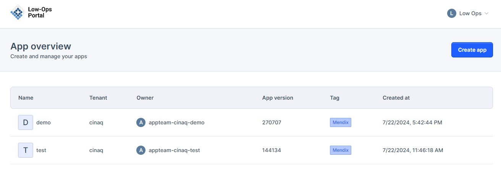
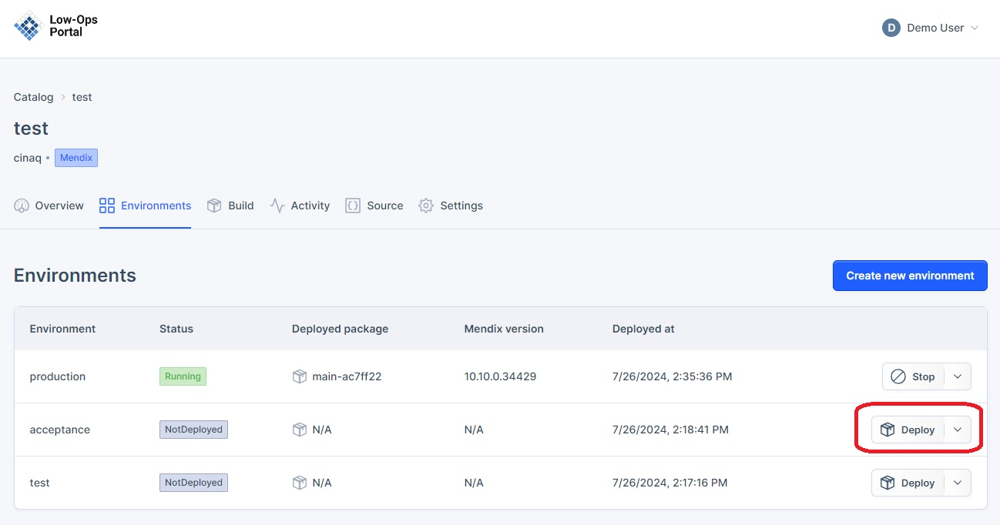
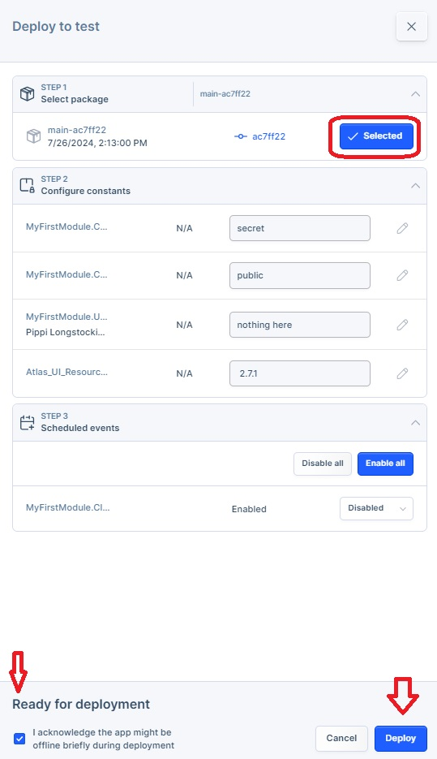
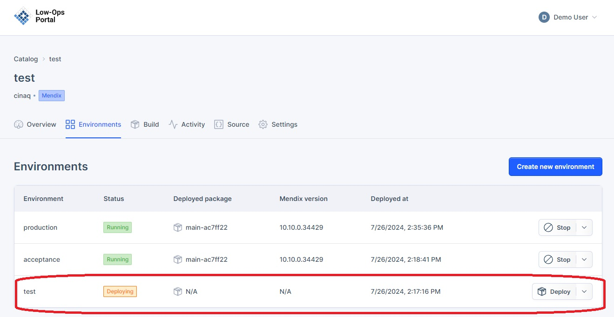
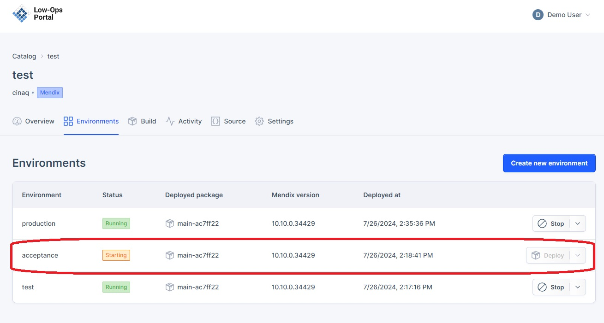

## *Deploy Specific Application Version to the Environment*

> **_NOTE:_** The following steps are the same for Test, Acceptance and Production environments. 

1. On the homepage, choose the application from the list. 

2. Once the application is selected, click on the `Environments` tab.

3. Select one of the environments such as `Test`,`Acceptance` or `Production`.

4. Click on the `Deploy` button as shown on the screenshot.  

5. In the side menu that opens up:

    - Step 1: Select the package version.

    - Step 2: Confugire Constants; provides the possibility to include new values. 

    - Step 3: Enable/Disable `MyFirstModule.Cleanup`.

    - Step 4: Check the box for `I acknowledge the app might be offline briefly during deployment`.

    - Click on the`Deploy` button.

6. The status of the environment should change to `Deploying`. 

7. Once the application is deployed, the status should change to `Running`.

  

8. Open the `Test` (`Acceptance`, `Production`) environment and click on the URL to ensure that the application opens up successfully.

## *Start the Application*

1. To start the application, simply click on the`Start` button.

2. The status of the environment should change to `Starting`.

4. Allow a minute or two for the application to start running again.
5. The status should change to `Running`.

6. Open the `Test` (`Acceptance`, `Production`) environment and click on the URL to ensure that the application opens up successfully.

## *Stop the Application*

1. Click on the `Stop` button.

2. The Status field should change to `Stopping`. 

3. Once the application is stopped,the status should change to `Stopped`. 

4. Attempting to access the URL should result in a `503 Service Temporarily Unavailable` error message.

