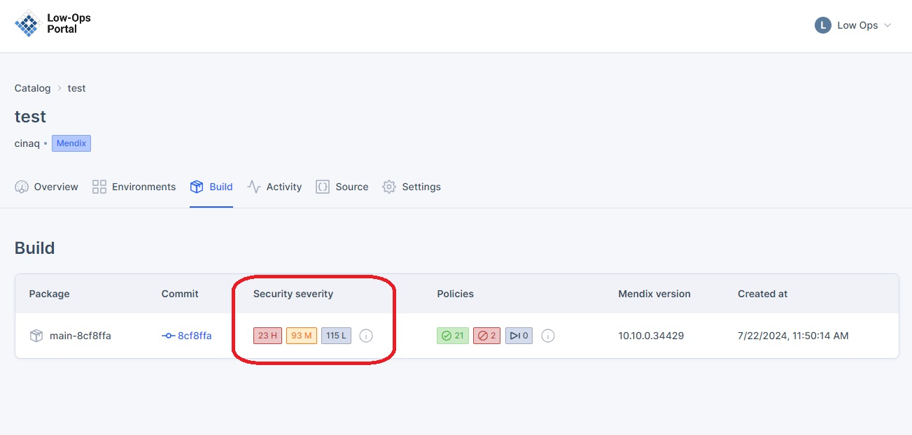
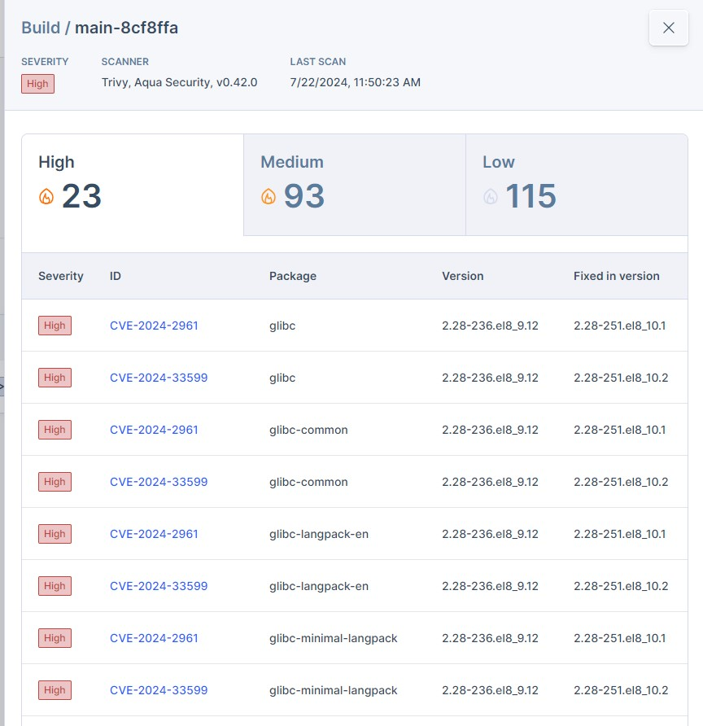

# Security

This document provides an overview of the Security Severity feature in your Mendix applications and instructions on how to access detailed security information.

## Understanding Security Severity

The Security Severity feature helps identify and categorize potential security issues within each build, allowing you to address vulnerabilities promptly.

## Accessing Security Severity Details

1. Navigate to the Build tab of your application.
2. Locate the Security Severity section.
3. Click on "Details" to access more comprehensive information about the security issues detected in a specific build.

4. In the Details view, you will see:
   - A summary of security vulnerabilities categorized by severity (High, Medium, Low)
   - A table listing specific vulnerabilities including their CVE IDs, affected packages, versions, and fixed versions

> **Note:** Regularly reviewing Security Severity information can help maintain the security of your Mendix applications and address potential vulnerabilities in a timely manner.

## Interpreting Security Severity Information

- High Severity: These issues require immediate attention and should be addressed as soon as possible.
- Medium Severity: These issues are important but may not require immediate action. They should be addressed in your next update cycle.
- Low Severity: These issues pose minimal risk but should still be reviewed and addressed when convenient.

> **Tip:** Always prioritize addressing high severity vulnerabilities to minimize potential security risks to your application.