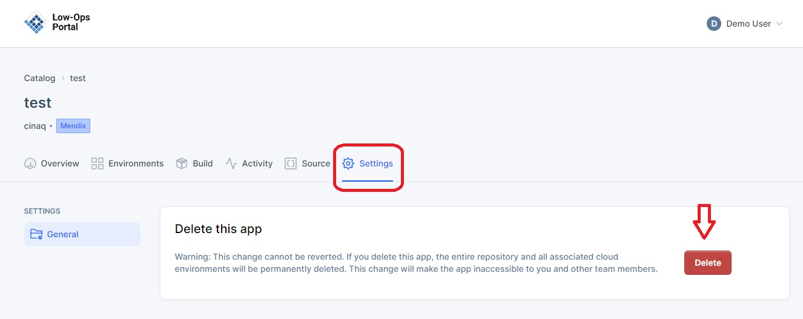

# Settings

Settings page allows to offboard an application. 

## Accesing "Settings" tab

1. From the "Home" page, select an application.
2. Navigate to the "Settings" tab.

> **_NOTE:_** To learn how to offboard an application, follow the steps from the [Offboard tutorial](../../../../offboard.md).