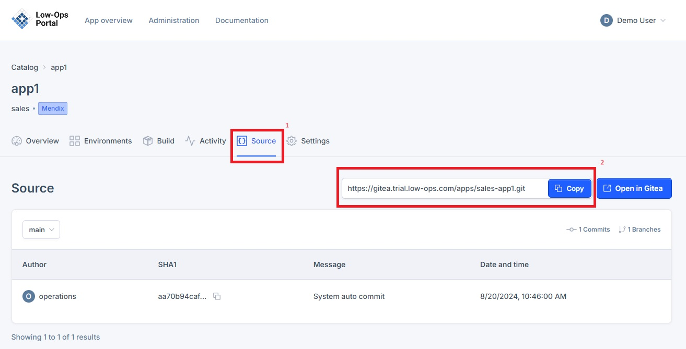

# Source

## Accesing "Source" tab

1. From the "Home" page, select an application.
2. Navigate to the "Source" tab.

## commit history 

## branch list, 

## connect with Mendix studio pro

To create a new application version in the Low-Ops platform, Copy the Git repository URL.

> **Note:** For instructions on logging into Mendix Studio Pro, refer to the [Mendix tutorial](../mendix.md).