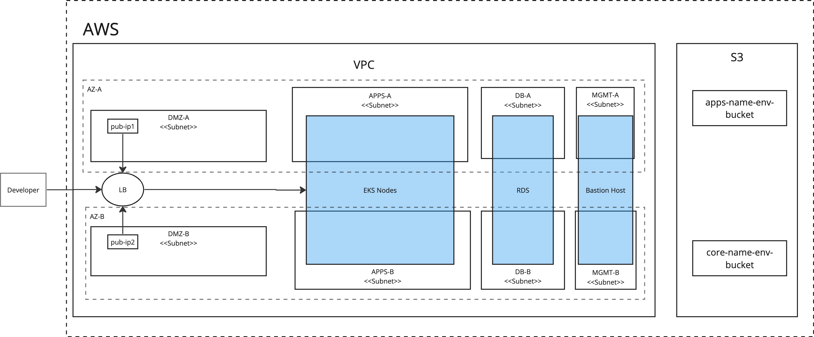

# Low Ops Platform setup

## Prerequisites

### Required packages

The following binaries must be present on the machine with access to Kubernetes api before starting:

- kubectl - `v1.27`
- helm - `v3.9`

### Kubernetes

LowOps platform requires a Kubernetes cluster.

Curently supported versions are:

- `1.27`

### Resources

To run the platform you'll need at least 16 GB RAM and 8 core CPU.

## Platform Foundation

The platform foundation is an infrastructure level that has to provide a scalable, flexeble and extensible enviromnemt for the platform lifecycle. To build the platform foundation, you can use cloud providers or on-premise solutions that allow you to run managed or self-managed Kubernetes (k8s) clusters.

There are 2 different platform `foundation_type`s:

- `generic` - Default platform installation method supports any Kubernetes custom or managed solution. All platform components required to run future applications workloads will be installed automatically.

- `aws` - Optimised platform installation for AWS-specific services natively supports other `AWS` services such as EKS, RDS, S3, ELB, EBS. To use AWS-managed data resources, you need to create them before platform installation as part of the foundation setup. Refer to the diagram bellow for more details.

High level AWS diagram:



## Platform Configuration

Before starting the platform installation process, check the configuration options below. Change required paramaters to match your environment setup.

Create values file `values.yaml` with following parameters:

`For more advanced configuration and options descriptions follow this [page](./advanced-configuration.md)`

```
lowops:
  image:
    containerImage: registry.gitlab.com/cinaq/low-ops-platform/ansible-roles:0-ci-v2-0-0

  # LowOps platfrom configuration variables
  config:
    common:
      base_domain: ci.cinaq.com
      platform_state: present
      foundation_type: generic
      email_domain: cinaq.com
      general_client_name: CINAQ
      platform_version: v2.0.0
  # Set lowops custom images tags to the same version
      rootfs_app_image_tag: 0-ci-v2-0-0
      rootfs_builder_image_tag: 0-ci-v2-0-0
      toolkit_image_tag: 0-ci-v2-0-0
      s3_gateway_image_tag: 0-ci-v2-0-0
      oauth2proxy_image_tag: 0-ci-v2-0-0
      keycloak_image_tag: 0-ci-v2-0-0
    ingress:
  # Update certificate and key params values to base64 encoded strings 
      default_ssl_cert: base64-encoded-cert-string
      default_ssl_key: base64-encoded-key-string
```


## Platform Installation

### Configure Namespace

Run script below to create deployment job namespace.
Add pull secret to the namespace. 

```
NAMESPACE=lowops-devops
kubectl create namespace "$NAMESPACE"

UPSTREAM_REGISTRY="registry.gitlab.com"
UPSTREAM_REGISTRY_USER="registry-user" # change with your resgitry user
UPSTREAM_REGISTRY_TOKEN="registry-token" # change with your registry password
UPSTREAM_REGISTRY_AUTH=$(echo -n "$UPSTREAM_REGISTRY_USER:$UPSTREAM_REGISTRY_TOKEN" | base64)

mkdir -p /tmp/lowops-docker-config
echo "
{
    \"auths\": {
        \"$UPSTREAM_REGISTRY\": {\"auth\": \"$UPSTREAM_REGISTRY_AUTH\"}
    }
}
" > /tmp/lowops-docker-config/config.json

# ensure lowops-registry secret exists
kubectl -n "$NAMESPACE" create secret generic lowops-registry --from-file=.dockerconfigjson=/tmp/lowops-docker-config/config.json --type=kubernetes.io/dockerconfigjson
```

### Install metallb

```
**Note:** This step is not needed for managed k8s solutions.
```

Add bitnami helm repo

```
helm repo add "bitnami" "https://charts.bitnami.com/bitnami"
helm repo update
```

Install metallb chart

```
# Network pool must be accesseble from cluster.
START_NETWORK=172.20.255.200
END_NETWORK=172.20.255.250
helm upgrade -i -n metallb --create-namespace metallb bitnami/metallb \
    --version 3.0.12 \
    --set "configInline.address-pools[0].name=default" \
    --set "configInline.address-pools[0].protocol=layer2" \
    --set "configInline.address-pools[0].addresses[0]=${START_NETWORK}-${END_NETWORK}" \
    --set "speaker.secretValue=stronk-key"
```

### Install Platform

From the deploy server with access to the Kubernetes cluster API. Install the platform by installing `lowops` helm chart.

Add lowops helm repository.

```
helm repo add --username $UPSTREAM_REGISTRY_USER --password $UPSTREAM_REGISTRY_TOKEN lowops \
    "https://gitlab.com/api/v4/projects/41532268/packages/helm/stable"

helm repo update
```

Run `helm install` command to start the platform setup process.

```
NAMESPACE=lowops-devops
CHART_VALUES_FILE=values.yaml
CHART_VERSION=0.1.70
HELM_CMD="helm upgrade -i lowops-platform lowops/lowops -n $NAMESPACE"
if [ -f "$CHART_VALUES_FILE" ]; then
    HELM_CMD="$HELM_CMD -f $CHART_VALUES_FILE"
fi
if [ -n "$CHART_VERSION" ]; then
    HELM_CMD="$HELM_CMD --version=$CHART_VERSION"
fi
echo "$HELM_CMD"
eval "$HELM_CMD"
```

After deploy job started you can get installation log

```
kubectl logs -n lowops-devops --timestamps=true job/lowops-platform -f
```

After deploy finished successfully start with exploring LowOps platform portal. In browser access https://portal.ci.cinaq.com (where `ci.cinaq.com` is your base domain.)