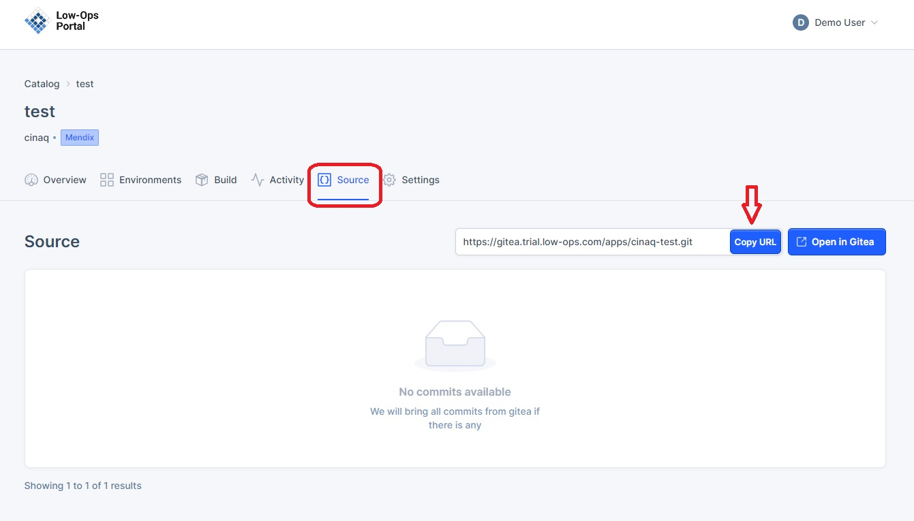
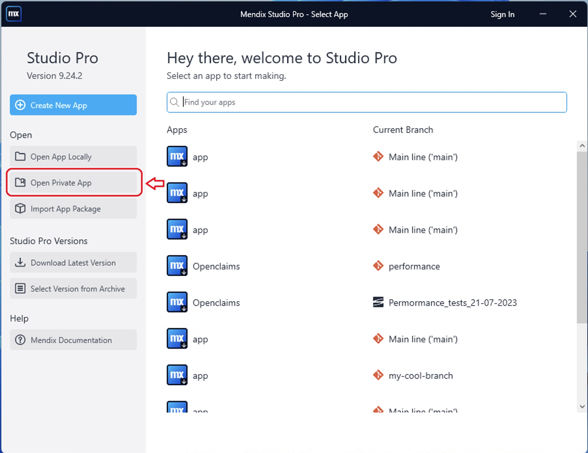
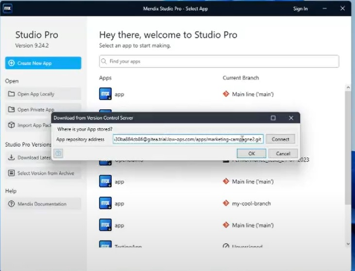
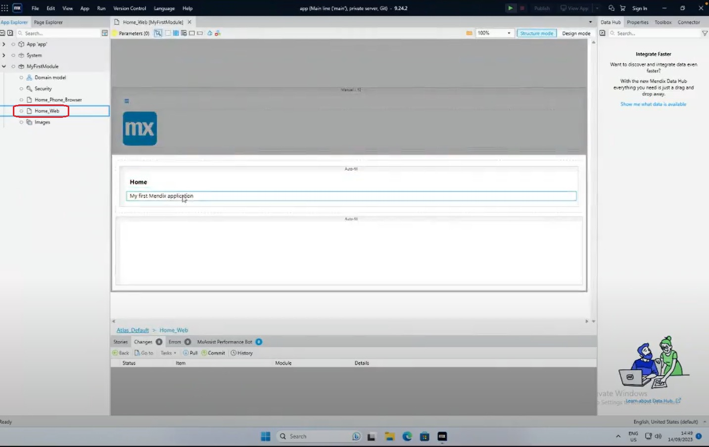
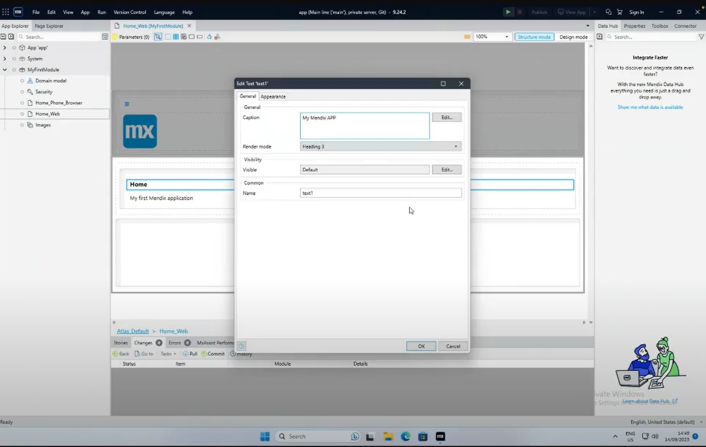
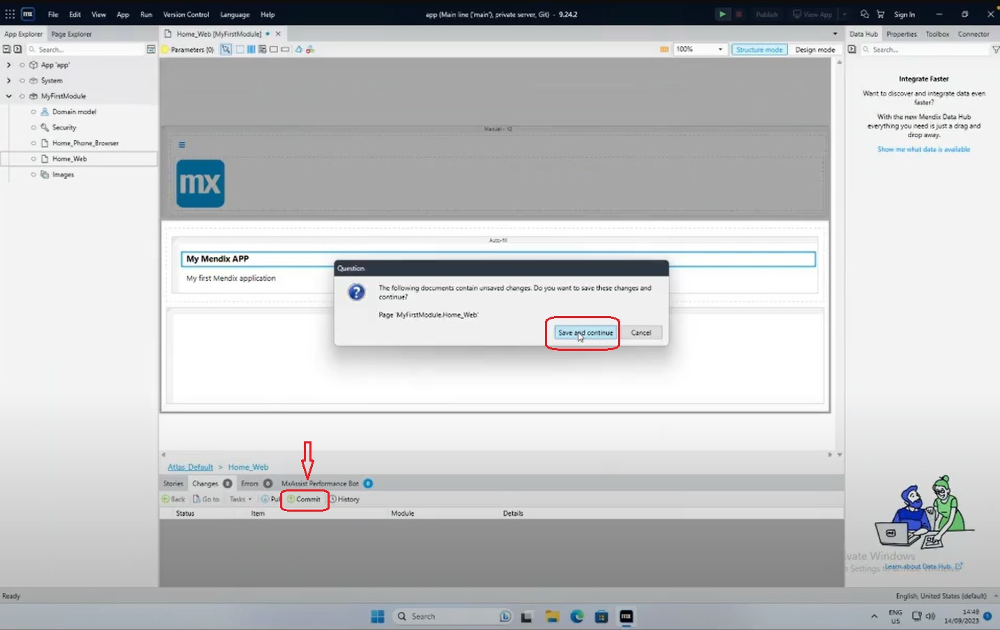
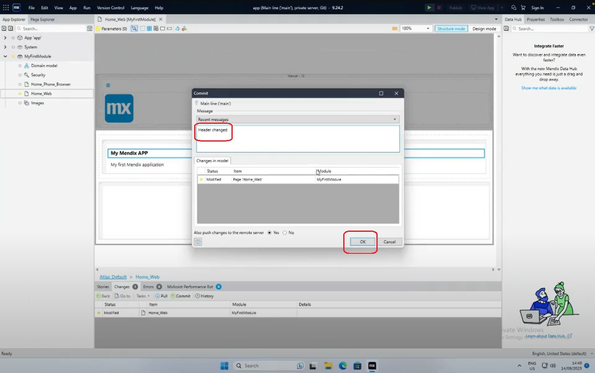
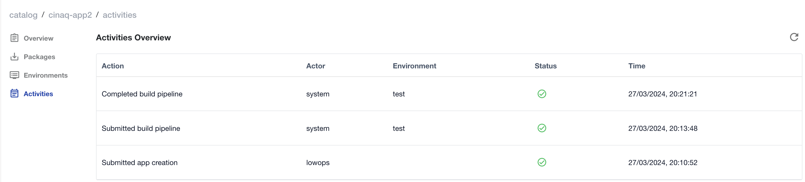
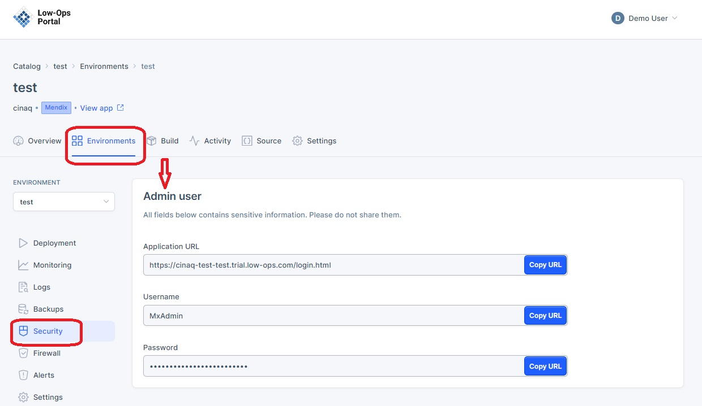
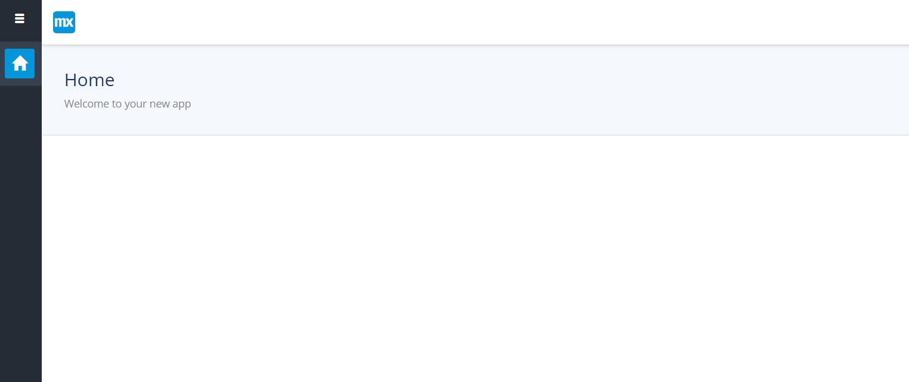

# Mendix Integration with Low-Ops Platform

This document guides you through creating and deploying new application versions in the Low-Ops platform using Mendix Studio Pro.

## Overview

Mendix Studio Pro is a powerful low-code development environment that allows developers to rapidly build and customize enterprise-grade applications. This guide covers the entire process, from accessing the Git repository to making changes in Mendix Studio Pro and verifying them across different environments.

## Prerequisites

- Access to the Low-Ops portal
- Mendix Studio Pro installed on your machine

> **Note:** For instructions on logging into the Low-Ops portal, refer to the [Login tutorial](../platform/login.md).

## Creating a New Application Version

### Access Git Repository

1. In the Low-Ops portal, navigate to the "Security" tab.
2. Copy the Git repository URL.

### Open Project in Mendix Studio Pro

1. In Mendix Studio Pro, click the "Open Private App" button.

2. In the pop-up window, paste the Git repository URL.
3. Click "Connect", then "OK".

### Make Changes

1. In the "MyFirstModule" menu, select "Home_Web" from the dropdown list.

2. Double-click the item you wish to modify.
3. Make your desired changes and click "OK".

### Commit Changes

1. Click the "Commit" button, then "Save and Continue".

2. In the pop-up window, describe your changes and click "OK".

## Verifying Changes

### Check Activities

1. In the Low-Ops platform, go to the "Activities" tab.
2. Wait for the status to change to "Completed".

### Access Test Environment

1. Go to the "Environments" tab and open the Test environment.

2. In the left-side menu, go to "Security".

### Verify Changes in Mendix

1. Use the provided URL and login credentials to access Mendix Studio Pro.
2. After logging in, you'll be directed to the Mendix home page where you can observe your implemented changes.

> **Note:** Repeat the verification process for Acceptance and Production environments as needed.