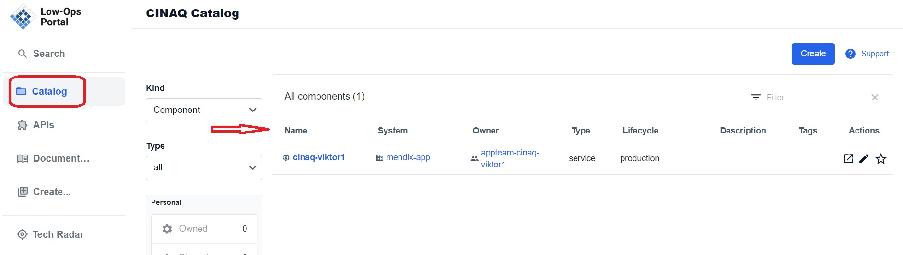
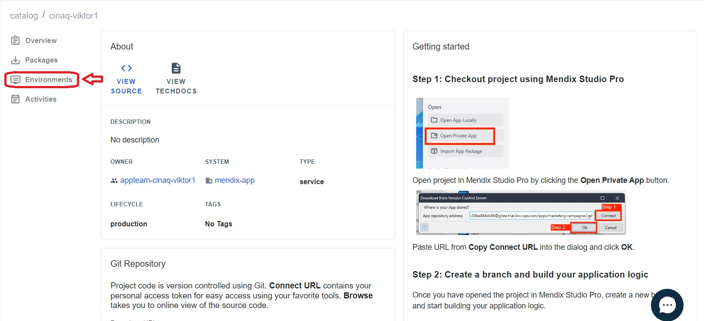
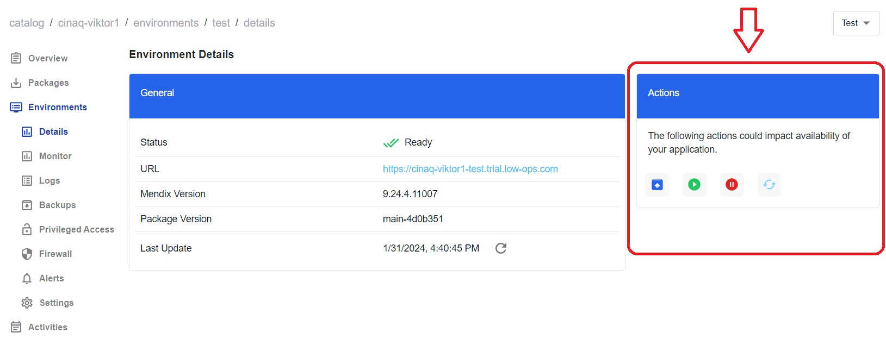
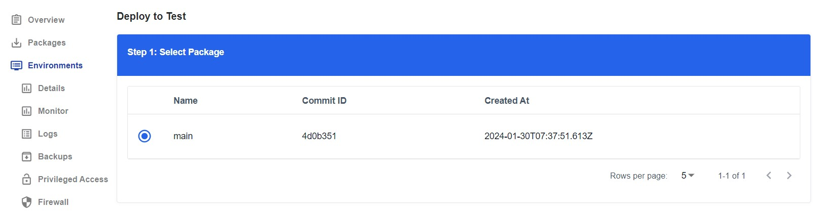
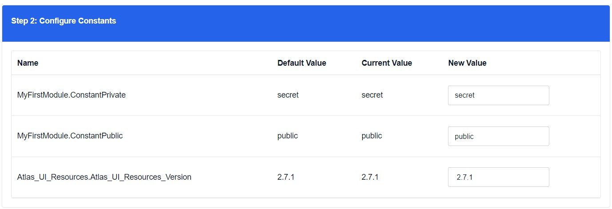

## *Deploy Specific Application Version to the Environment*

> **_NOTE:_** The following steps are the same for Test, Acceptance and Production environments. 

1. On the `Catalog` homepage, choose the application from the list. 

2. Once the application is selected, the navigaion menu will appear on the left side. Click on the `Environments` tab.

3. Select one of the environments such as `Test`,`Acceptance` or `Production`.

4. Under the `Actions` section, click on the `Deploy` button. 

> **_NOTE:_** A pop-up window appears with the message `Deployment request submitted` after clicking the `Deploy` button.

3. On the new page that opens up:
    - Step 1: Select the package version.

    

    - Step 2: Confugire Constants; provides the possibility to include new values. 

     

    - Step 3: Enable/Disable `MyFirstModule.Cleanup`.

    

    - Step 4: Check the box for `I acknowledge the app might be offline briefly during deployment`.

    

    - Click on the`Deploy` button.

4. Go back to the `Environment` tab to see the status of deployment.

5. Once the application is deployed, the status should be `Ready`.

 

6. Verify the successful completion of deployment when the `package version`, `Mendix version`, and `updated on` fields contain the necessary details.

7. Select the `Test` (`Acceptance`, `Production`) environment and click on the URL to ensure that the application opens successfully.

## *Start the Application*

1. Under the `Actions` section click on the `Start` button.

2. Click on `Confirm` in the pop up window that appears.

3. The Status field should change to `Deploying`. 

4. Allow a minute or two for the application to start running again.

5. Once the status changes to `Ready`, click on the URL to ensure that the application opens up successfully.

## *Stop the Application*

1. Under the `Actions` section, click on the red `Stop` button.

2. Click on `Confirm` in the pop up window that appears.

3. The Status field should change to `Stopped`. 

4. Attempting to access the URL should result in a `503 Service Temporarily Unavailable` error message.
 

 ## *Restart the Application*

1. Under the `Actions` section, click on the red `Restart` button.

2. Click on `Confirm` in the pop up window that appears.

3. The Status field should change to `Deploying`. 

4. Allow a minute or two for the application to start running again.

5. Once the status updates to `Ready`, click on the URL to ensure that the application opens up successfully.
