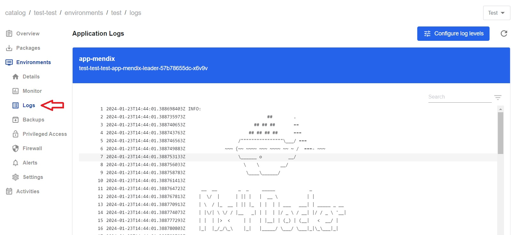
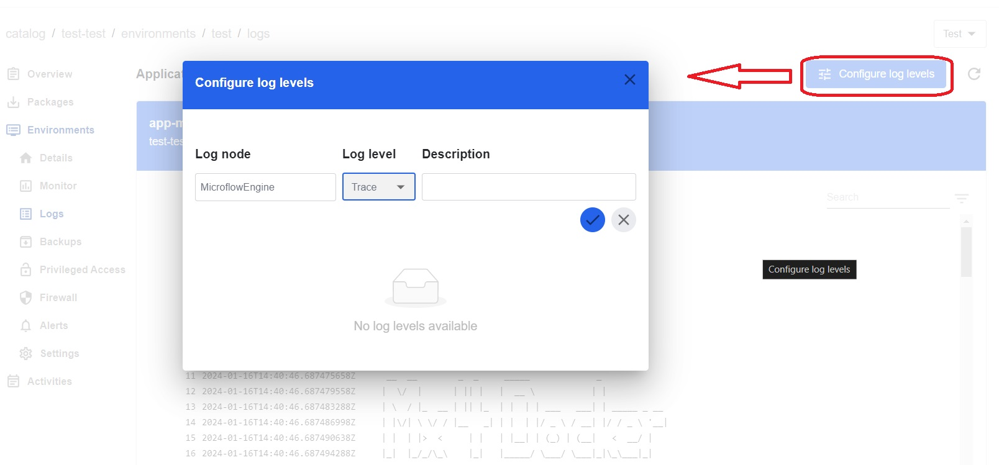

## *Log Levels*

*Logs  capture information about events, activities, errors, or status changes; serve as a valuable resource for troubleshooting, debugging, and monitoring system performance.*

To access the `Logs` tab, follow the steps below:

1. On the `Catalog` homepage, choose the application from the list. 
2. Once the application is selected, the navigaion menu will appear on the left side. Click on the `Environments` tab.
3. Select one of the environments such as `Test`,`Acceptance` or `Production`.

4. Once one of the environments is selected, a new dropdown navigation menu will appear. 
5. In the left-side menu, select `Logs`.

 

## *Configure Log Levels*

1. Click on `Configure Log Levels` in the upper right corner.
2. In the pop-up window, specify the `Log node`, select `Log level` from a drop down menu, provide `Description` if necessary and click on the blue button. 

 

> **_NOTE:_** Re-deploy the application for changes to take place.

3. Return to `Logs` to review the traces. 
