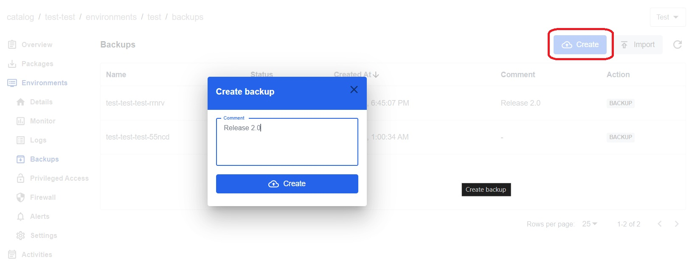

## Create a Backup from a Portal*

1. Go to the `Environment` tab.
2. Click on the `Test` (`Acceptance`, `Production`) environment.
3. In the left menu, select `Backups`.
4. Click on the `Create` button to initiate a new backup. 
5. In the pop-up window, include the name and click on `Create`.

6. The backup is successfully created when the status changes to a greeen checkmark `Complete`.

## *Manage Backups*

1. In the left-side menu, select `Backups`.
2. Choose the backup from the list and click on it.
3. In the pop-up window click on the `Restore` button to restore the backup.
4. Click on the `Delete` button to delete the backup.
5. To import a backup, return to the list of backups and click on the `Import` button in the upper right corner.
6. Upload a file from your computer and wait for it to load.
7. The backup is successfully uploaded when the status changes to a greeen checkmark `Complete`
