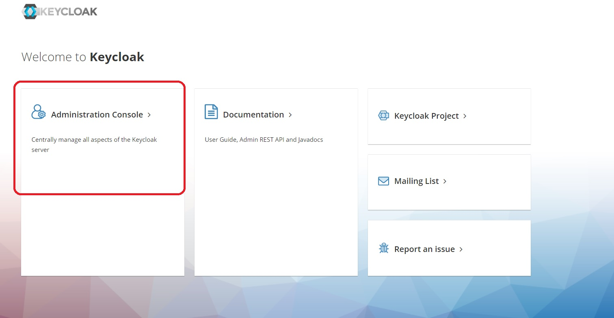
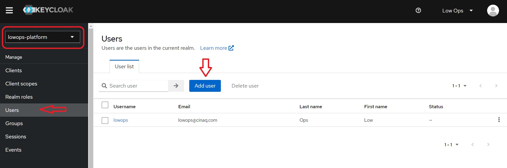
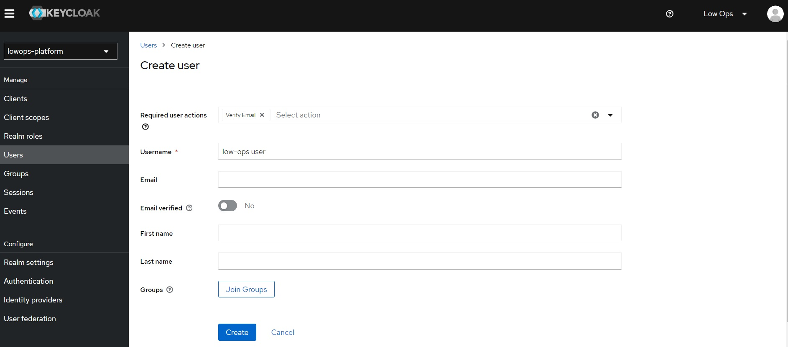
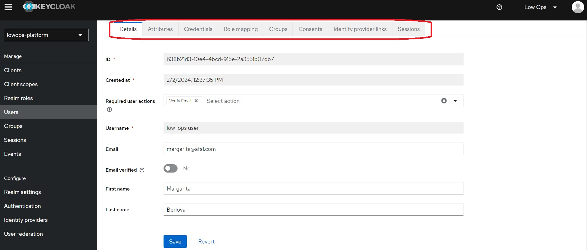
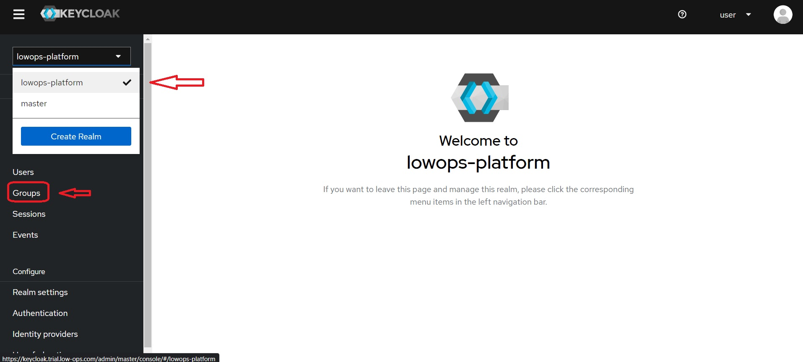
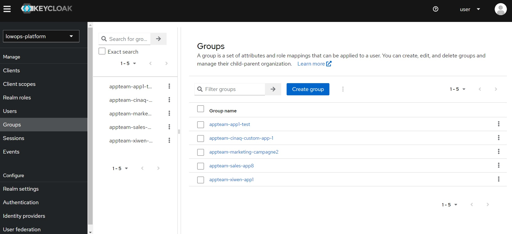
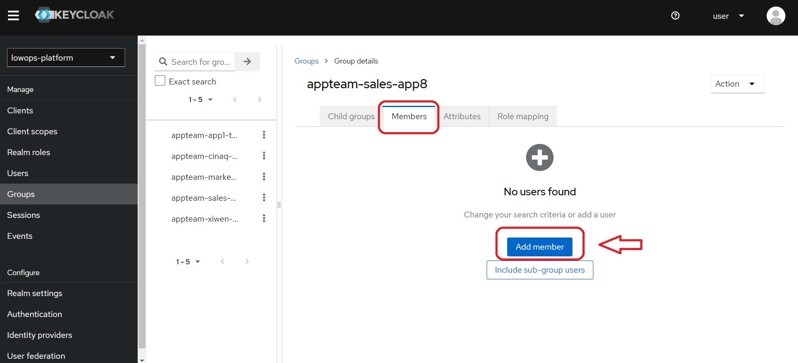
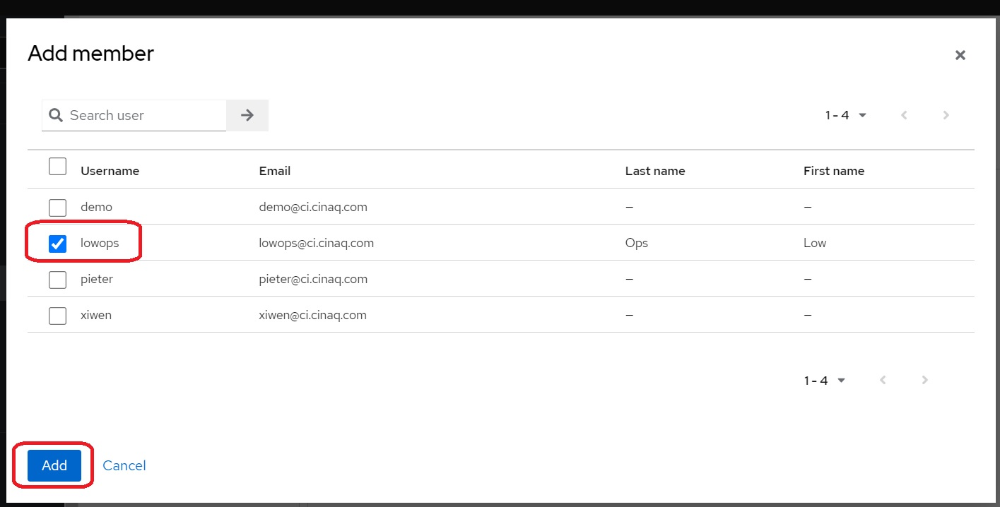
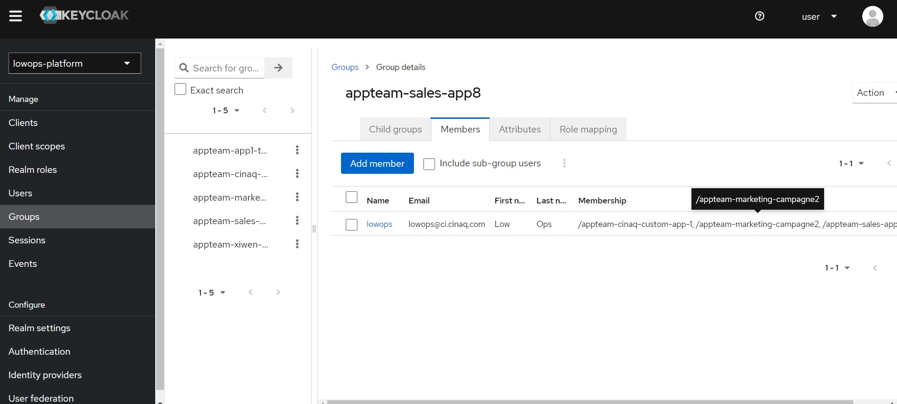

## *How to add new user using keycloak UI*

**Keycloak is a single sign-on (SSO) solution, providing a centralized authentication service that allows users to log in once and access multiple applications or services without having to authenticate separately for each.**

1. Open your web browser and navigate to https://keycloak.trial.low-ops.com/.
2. Click on `Administration Console.`
3. Provide your login and password credentials.

4. From the left-hand dropdown menu, choose `lowops-platform`, and then click on the `User`.

5. Click on the `Add` button to add a new user. 

6. On the new page that open up, specify user details and click on `Create`.

7. Once the user is created, you should be able to update user details by navigating through various tabs, such as `Details`, `Attributes`, `Role mapping`, `Groups`, `Consents`, `Identity provider links`, `Sessions`. 

## *How to add a member to the group to make the component visible on the Catalog page.*

*To ensure the created component is visible on the Catalog home page, please follow the steps below:*

1. In keycloak, from the left-hand dropdown menu, choose `lowops-platform`, and then click on the `Groups`.

2. Select the appropriate group name from the list and then click on it.

3. Navigate to the `Members` tab and then click on the `Add Member` button.

4. Choose `lowops` and then click on the `Add` button.

> **_NOTE:_** After adding the new member, you will see their name in the list, and the created component will be visible on the Catalog page in the Low-Ops portal in a few minutes. 

