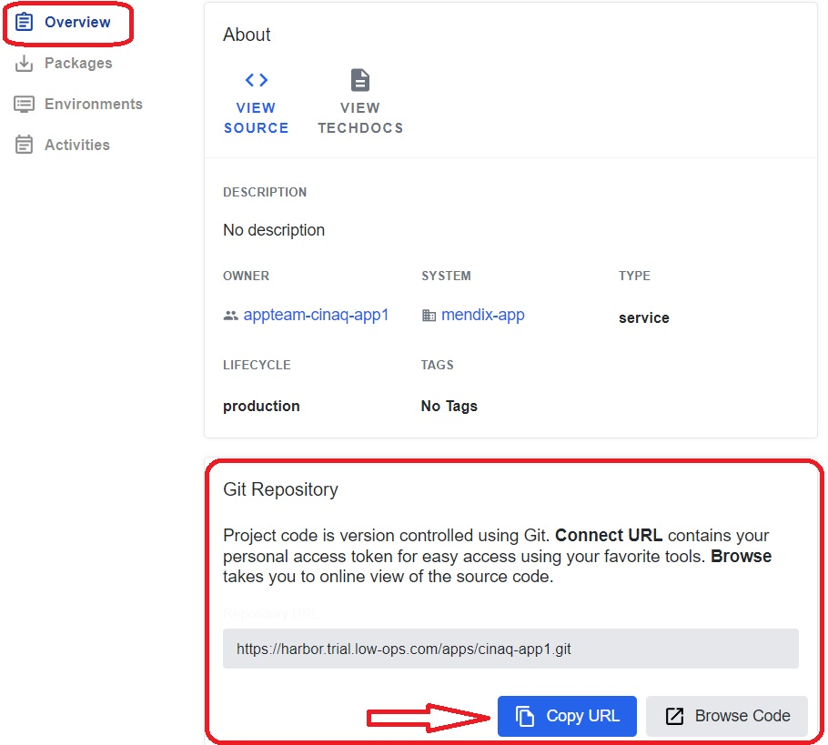
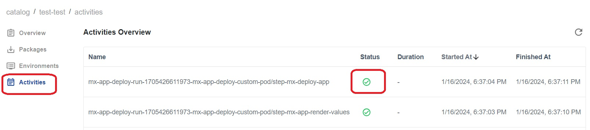
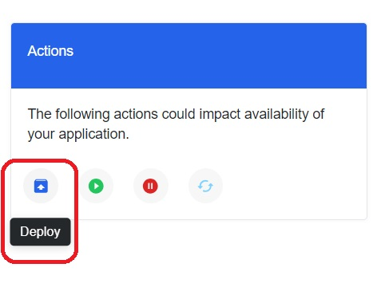

## *Create New Application Version Release*

1. Access the `Overview` tab by opening the component and then copy the Git repository URL.

    

2. Within Mendix Studio Pro, locate and select the `Open Private App` button.

3. In the pop-up window, paste the previously copied Git repository URL and click on the `Connect` button. Afterward, click on `OK` and wait for the program to load.

4. Choose `Home_Web` from the dropdown list in the `MyFirstModule` menu.

5. Double-click on the item you wish to modify, make the desired changes, and then click on `OK`.

6. Select the `Commit` button, and then proceed by clicking on `Save and Continue`.

7. In the pop-up window, specify the changes that were made, and then click on the `OK` button.

8. Navigate back to the Low-Ops platform and access the `Activities` tab. After the changes are complete, you will observe the status transition to `Complete`.

9. Proceed to the `Environments` tab, and select the `Test` environment.
10. In the left-side menu, select `Privilieged Access`.
11. Use the URL and login credentials to log in to `Mendix Studio Pro`.
12. After a successful login, you will be automatically directed to the Mendix home page, where you can observe the implemented changes.

# Deploy Application

## *Deploy Specific Application Version to the Environment*

The following steps are the same for Test, Acceptance and Production environments. 

Open the newly created application and click on the `Environment` tab on the left side menu. 

1. Select the `Test` (`Acceptance`, `Production`) environment.
2. Under the `Actions` section, click on the `Deploy` button. 

3. On the new page that opens up:
    - Step 1: Select the package version.
    - Step 2: Confugire Constants; provides the possibility to include new values. 
    - Step 3: Enable/Disable `MyFirstModule.Cleanup`.  
    - Step 4: Check the box for `I acknowledge the app might be offline briefly during deployment`.
    - Click on `Deploy` button.
4. Go back to the Environment tab to see the status of deployment.

**Verify**

 - A pop-up window appears with the message `Deployment request submitted` after clicking the `Deploy` button.
 - Confirm that the status of the application is updated.
 - Verify the successful completion of deployment when the `package version`, `Mendix version`, and `updated on` fields contain the necessary details.
 - Select the `Test` (`Acceptance`, `Production`) environment and click on the URL to ensure that the application opens successfully.

 
