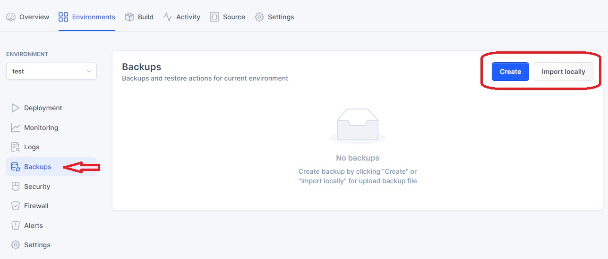
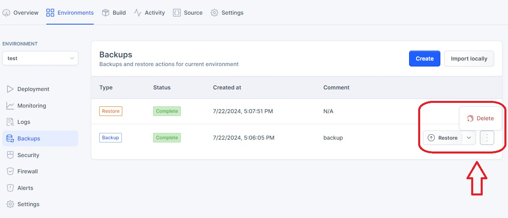

## *Backups*

*Backups serve as essential data insurance, ensuring quick recovery and minimal operational overhead in the face of data loss or system failures.*

To access the `Backups` tab, follow the steps below:

1. On the `Catalog` homepage, choose the application from the list. 
2. Once the application is selected, the navigaion menu will appear on the left side. Click on the `Environments` tab.
3. Select one of the environments such as `Test`,`Acceptance` or `Production`.

4. Once one of the environments is selected, a new dropdown navigation menu will appear. 
5. In the left-side menu, select `Backups`.

## *Create a Backup*

To create a backup from the current application, follow the steps below:

1. On the `Backups` page, click on the `Create` button to initiate a new backup. 

2. In the pop-up window, include the name and click on `Create`.

3. The backup is successfully created when the status changes to a greeen checkmark `Complete`.

## *Import a Backup*

To import a backup, follow the steps below:

1. Click on the `Import` button in the upper right corner.

2. Upload the backup file from your device in the CSV format and wait for it to load.

3.  The backup is successfully created when the status changes to a greeen checkmark `Complete`.

## *Manage Backups*

1. Choose the backup from the list and click on it.
3. In the pop-up window click on the `Restore` button to restore the backup.
4. Click on the `Delete` button to delete the backup.

