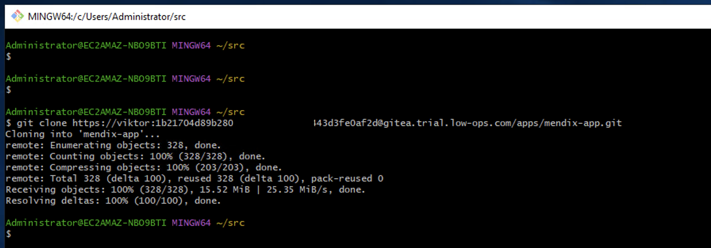
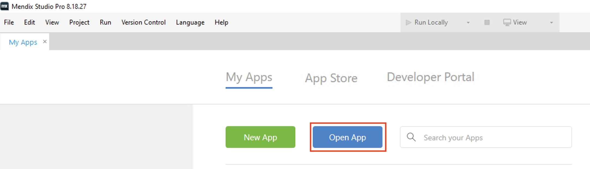
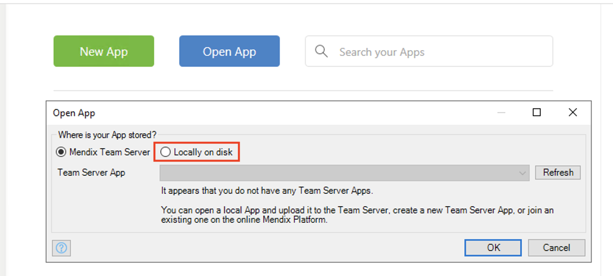
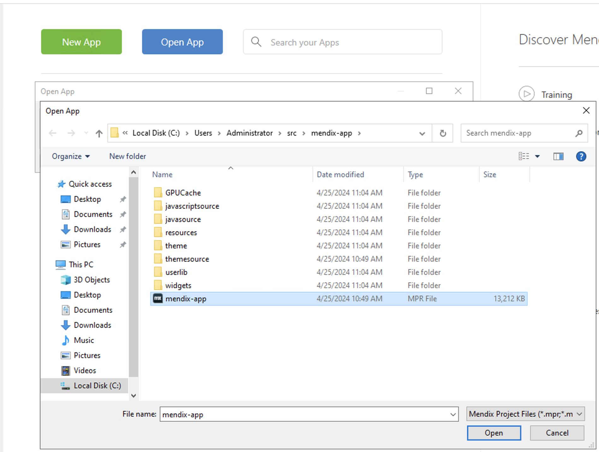
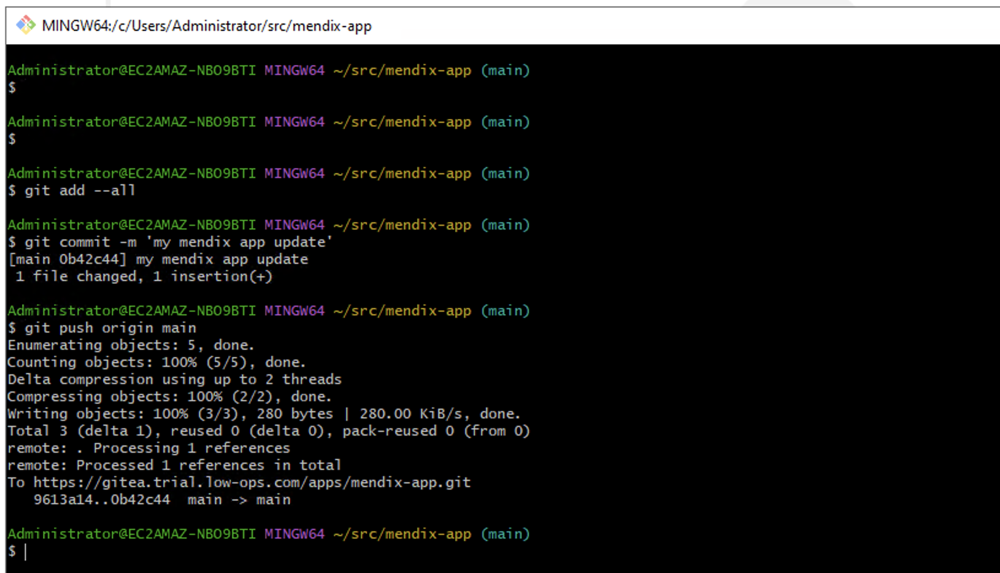

## **Mendix 8 Support**

Low Ops platform utilizes private Git repositories to store Mendix application source code.

Mendix Studio Pro versions before 9 are compatible only with SVN (Version Control System) and do not support Git. Consequently, Git command line interface is employed for committing and pushing changes to remote repositories.

### **Instructions:**

1. **Download and Install Git-Bash:**
   - Begin by downloading and installing Git-Bash. 

2. **Clone the Mendix Project:**
   - Use Git-Bash to clone the Mendix project repository.
   

3. **Open Mendix Studio Pro:**
   - Launch Mendix Studio Pro and click on "Open App."
   

4. **Select Locally on Disk:**
   - Choose the "Locally on Disk" option.
   

5. **Navigate to Cloned Project:**
   - Navigate to the directory where the project was cloned and select the .mpr file.
   

6. **Commit and Push Changes:**
   - After making changes to your application, return to Git-Bash and commit and push the changes to the remote repository using Git commands.
   
