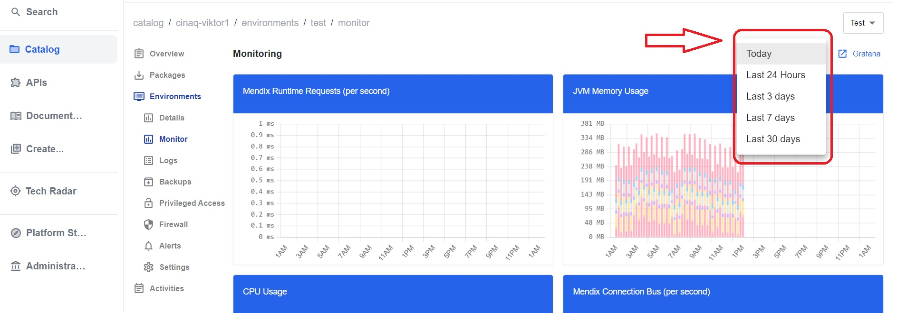

## *Monitor Metrics*

*Monitoring is essential for proactively identifying and addressing system issues, ensuring performance, and maintaining overall reliability with minimal manual intervention.*

**To access the `Monitor` tab, follow the steps below:**

1. On the `Catalog` homepage, choose the application from the list. 
2. Once the application is selected, the navigaion menu will appear on the left side. Click on the `Environments` tab.
3. Select one of the environments such as `Test`,`Acceptance` or `Production`.

4. Once one of the environments is selected, a new dropdown navigation menu will appear. 
5. In the left-side menu, select `Monitor`.

6. From the drop down menu in the upper right corner, select the period for which to display the metrics: `Today`, `Last 24 hours`, `Last 3 days`, `Last 7 days`, `Last 30 days`.

 **Microflow metrics - Mendix Microflow Execution Frequency**

Displays Mendix Microflow Executon Frequency (per second).

 **Microflow metrics - Mendix Microflow Execution Time**

Displays Mendix Microflow Execution Time.

## *Alerts*

*Alerts serve as automated notifications that promptly inform operators about potential issues or deviations from normal behavior, enabling rapid response and resolution.*

**To access the `Alerts` tab, follow the steps below:**

1. On the `Catalog` homepage, choose the application from the list. 
2. Once the application is selected, the navigaion menu will appear on the left side. Click on the `Environments` tab.
3. Select one of the environments such as `Test`,`Acceptance` or `Production`.

4. Once one of the environments is selected, a new dropdown navigation menu will appear. 
5. In the left-side menu, select `Alerts`.

6. The `State` column will notify if the application is running without problems or if any problems have occured.
