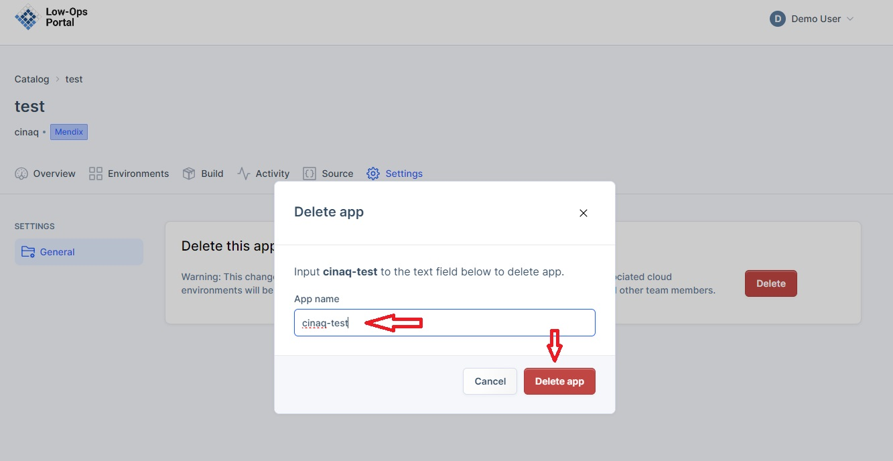

# Offboard an Application

**To login to the Low-Ops portal, follow the steps below:**

 1. Navigate to the link: https://portal.trial.low-ops.com/
 2. Click on the button `Log in with SSO`.

 

 3. Enter your username/email and password.

  

 4. Click on the `Log in` button.

Once logged in, you will be redirected to the Low-Ops portal.

## *Offboard an Application*

**To offboard an application, follow the steps below:**

1. From the `Home` page, click on the application you want to offboard and navigate to the `Settings` tab. 

2. A pop-up window will appear, input the app name and click `Delete app` to delete the application.

