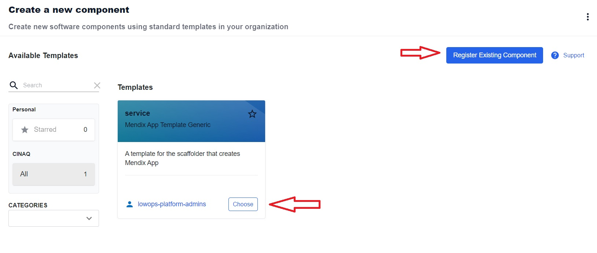
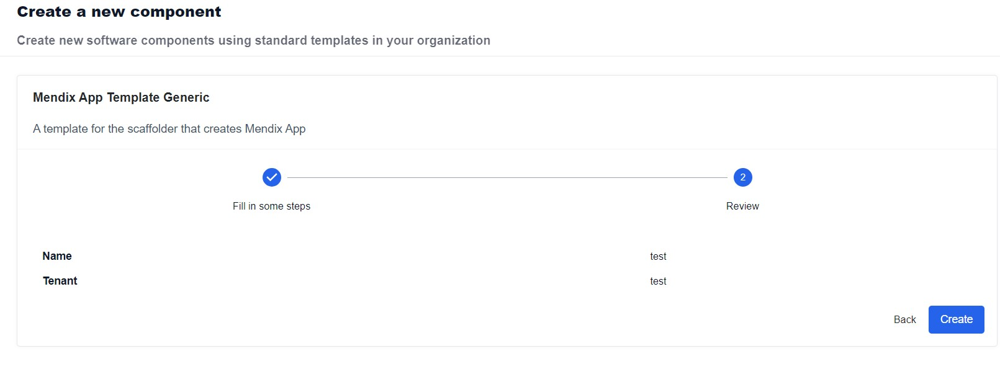
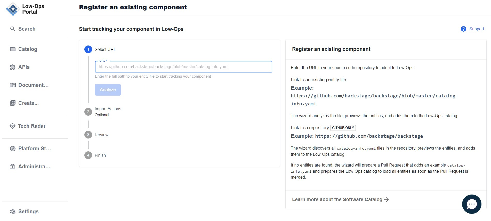

# Onboard New Application

**To login to the low-ops portal, follow the steps below:**

 1. Navigate to the link: https://portal.trial.low-ops.com/
 2. Click on the button `Log in with SSO`.

 

 3. Enter your username/email and password.

  

 4. Click on the `Log in` button.

Once logged in, you will be redirected to the Low-Ops portal.

## *Create New Application*

**To create a new application, follow the steps below:**

1. On the `Catalog` home page, there are two options for creating a new application:
- on the left side menu, click on the `Create` button.
- in the upper right corner, click on the `Create` button.

2. There are two options for creating a new component:
- by using the available template and clicking on the `Choose` button. 
- by registering the existing component. 

**Creating application from a template:**

1. Once the template is selected, click on the `Choose` button, and you will be redirected to a new page to fill out the credentials.

2. Fill in the fields for the `Unique name of the component` and `Tenant name of the component` and click on the `Review` button. 
3. Verify the included information is correct, proceed by clicking on the `Create` button.

> **_NOTE:_** Allow a couple of minutes for the application to create. 

4. Once the application is created, navigate back to the `Catalog` tab to view it in the list of components. 

**Creating application from existing component:**

1. Click on the `Register Existing component`.

2. Enter the URL to your source code repository to add it to Low-Ops.

3. The wizard will analyze the file, preview the entities, and add them to the Low-Ops catalog.

4. If no entities are found, the wizard will prepare a Pull Request that adds an example catalog-info.yaml and prepares the Low-Ops catalog to load all entities as soon as the Pull Request is merged.
