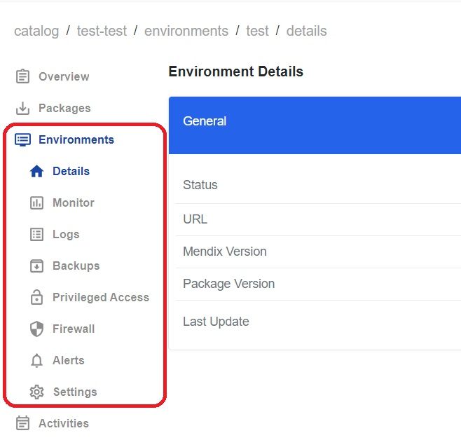

# Onboard New Application

## *Create New Application*
Create a new application, ensuring it is created without any errors.

 1. Navigate to the link: https://portal.trial.low-ops.com/
 2. Click on the button `Log in with SSO`.
 3. Enter your username/email and password.
 4. Click on the `Sign in` button.

Once logged in, you will be redirected to the Low-Ops portal.

To create a new application, follow the steps below:

 5. In the left menu, click on the `Create` button. 
 6. Select the `Mendix App Template Generic`.
 7. Click on the `Choose` button.
 8. Fill in the fields for the `Unique name of the component` and `Tenant name of the component`.	
 9. Click on `Create`.

After the application is created, go to the Catalog tab to view it in the list of components. 

## *Deploy the Application to the Environment*

The following steps are the same for Test, Acceptance and Production environments. 

Open the newly created application and click on the `Environment` tab on the left side menu. 

1. Select the `Test` (`Acceptance`, `Production`) environment.
2. Under the `Actions` section, click on the `Deploy` button. 
3. On the new page that opens up:
    - Step 1: Select `Main` package.
    - Step 2: Leave it as is.
    - Step 3: Enable `MyFirstModule.Cleanup`.  
    - Step 4: Check the box for `I acknowledge the app might be offline briefly during deployment`.
    - Click on `Deploy` button.
4. Go back to the Environment tab to see the status of deployment.

**Verify**

 - A pop-up window appears with the message `Deployment request submitted` after clicking the `Deploy` button.
 - Confirm that the status of the application is updated.
 - Verify the successful completion of deployment when the `package version`, `Mendix version`, and `updated on` fields contain the necessary details.
 - Select the `Test` (`Acceptance`, `Production`) environment and click on the URL to ensure that the application opens successfully.

 
## *Commit the New Application Source Code to Gitea and Push the New Application Package to Harbor.*

1. Login to Gitea with your credentials.
2. Open the newly created application.
3. Open a `README` file, make a change, and click on the `Commit Changes` button. 
4. Go back to the portal. 

**Verify**

- In the `Environment` tab, the `Test` environment should be updated with the new `package version`.  
- In the`Packages` tab, new package should appear in the list.

## *View Package in Harbor*

In the `Packages` tab, click on the `Package` to view the detials. 
A new window with details should pop up.

## *Stop the Application in the Test/Acceptance/Production Environments*

1. Go to the `Environment` tab.
2. Click on the `Test` (`Acceptance`, `Production`) environment.
3. Under the `Actions` section, click on the red `Stop` button.
4. Click on `Confirm` in the pop up window that appears.

**Verify**

- The Status field should change to `Stopped`. 
- Attempting to access the URL should result in a `503 Service Temporarily Unavailable` error message.

## *Start the Application in the Test/Acceptance/Production Environments*

1. Go to the `Environment` tab
2. Click on the `Test` (`Acceptance`, `Production`) environment.
3. Under the `Actions` section click on the `Start` button.
4. Click on `Confirm` in the pop up window that appears.

**Verify**

- The Status field should change to `Running`. 
- Allow a minute or two for the application to start running again.
- Click on the URL to ensure that the application opens up successfully.

## *Validate Monitoring for Metrics' Availability*

1. Go to the `Environment` tab.
2. Click on the `Test` (`Acceptance`, `Production`) environment.

3. In the left menu, select `Monitor`to review the metrics.
4. From the drop down menu in the upper right corner, select the period for which to display the metrics: `Today`, `Last 24 hours`, `Last 3 days`, `Last 7 days`, `Last 30 days`.

## *Validate Logs*

1. Go to the `Environment` tab.
2. Click on the `Test` (`Acceptance`, `Production`) environment.
3. In the left menu, select `Logs` to review the logs.
4. Click on `Configure Log Levels` in the upper right corner.
5. In the pop-up window, specify the `Log node`, select `Log level` from a drop down menu, provide `Description` if necessary and click on the blue button. 

 

6. Re-deploy the application by following the steps from `Deploy Application to the Environment`
7. Return to "Logs" to review the traces. 

## Create a Backup from a Portal*

1. Go to the `Environment` tab.
2. Click on the `Test` (`Acceptance`, `Production`) environment.
3. In the left menu, select `Backups`.
4. Click on the `Create` button to initiate a new backup. 
5. In the pop-up window, include the name and click on `Create`.

6. The backup is successfully created when the status changes to a greeen checkmark `Complete`.

## *Manage Backups*

1. In the left-side menu, select `Backups`.
2. Choose the backup from the list and click on it.
3. In the pop-up window click on the `Restore` button to restore the backup.
4. Click on the `Delete` button to delete the backup.
5. To import a backup, return to the list of backups and click on the `Import` button in the upper right corner.
6. Upload a file from your computer and wait for it to load.
7. The backup is successfully uploaded when the status changes to a greeen checkmark `Complete`

## *Validate Privileged Access*

1. Go to the `Environment` tab.
2. Click on the `Test` (`Acceptance`, `Production`) environment.
3. In the left-side menu, select `Privileged Access`.
4. Use the URL and login credentials to log in to Mendix Studio Pro.

## *Validate Firewall*

1. Go to the `Environment` tab.
2. Click on the `Test` (`Acceptance`, `Production`) environment.
3. In the left-side menu, select `Firewall`.
4. Click on the `Create rule` button in the upper right corner.

5. In the window that pops up, indicate the rule details and click on `Save`.
6. Re-deploy the application by following the steps from `Deploy application to Test environment`.
7. Wait for the application to re-deploy.
8. From the `Details` tab, use the URL to log in to Mendix Studio Pro.
9. Verify that the created rule works as specified.
10. To update the Firewall rule, go back to the `Firewall` tab and click on the three dots, which will allow to `Edit` or `Delete` the rule. 

## *Validate Alerts*

Ensure that alerts are displayed. 

## *Validate Settings*

This page allows you to view and make changes to the current settings. It is divided into three blocks: `Settings`, `Environment Variables`, and `Runtime Settings`.

**`Setting` section**

Consists of Domain and Scaling settings that can be modified as needed.

*To make changes*:

 - Click on the `Edit` button in the upper right corner.
 - Update the fields with changes and click on the `Save` button.
 
**Environment Variable section**

Allows you to add a new environment variable.

 - Click on the `Add` button in the upper right corner.
 - In the pop-up window, include the `Name`, `Value`, and `Description`, check the `Protected` checkbox (optional), and click on the `Add` button.

**Runtime Settings Section**

Allows you to add a new runtime setting.

 - Click on the `Add` button in the upper right corner.
 - In the pop-up window, include the `Name`, `Value`, and click on the `Add` button.

For the new setting values to take effect, re-deploy the application.

# Release 2.0

## **New Environment Navigation**

The new environment navigation appears on the left side as a dropdown menu, which becomes visible once one of the environments is chosen.

## **Microflow metrics - Mendix Microflow Execution Frequency**

New Metrix added to display Mendix Microflow Executon Frequency (per second). 

## **Microflow metrics - Mendix Microflow Execution Time**

New Metrix added to display Mendix Microflow Execution Time. 

## **CNPG**

## **New S3 Storage Model**

## **Backups Importing with New Model**

## **Oauth - Keycloak Branded Login Screens**

New branded login screens were implemented for Outh and Keycloak. 

## **IP Filtering (Firewall)**

## **Backstage with Backend**

