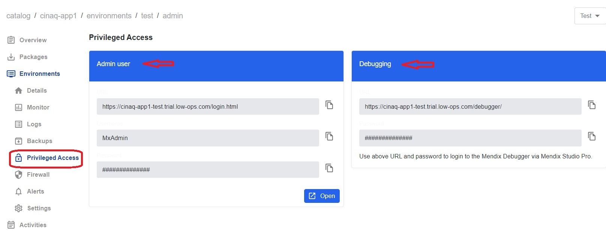

## *Privileged Access*

1. Go to the `Environment` tab.
2. Click on the `Test` (`Acceptance`, `Production`) environment.
3. In the left-side menu, select `Privileged Access`.
4. Under the `Admin User` section, you will find the URL and login credentials to log in to Mendix Studio Pro.
5. Under the `Debugging` section, you will find URL and password to login to the Mendix Debugger via Mendix Studio Pro.

