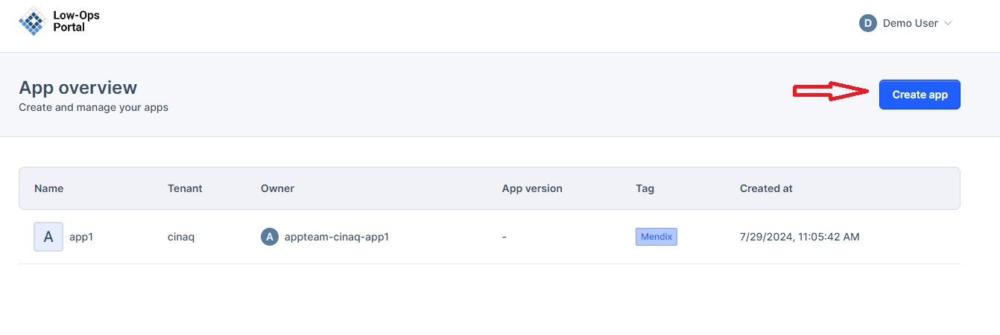
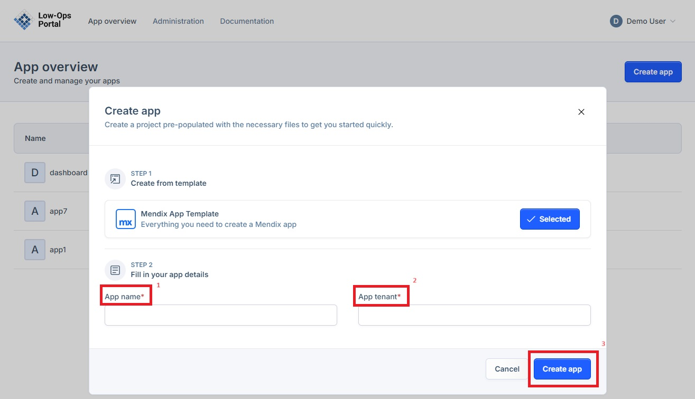
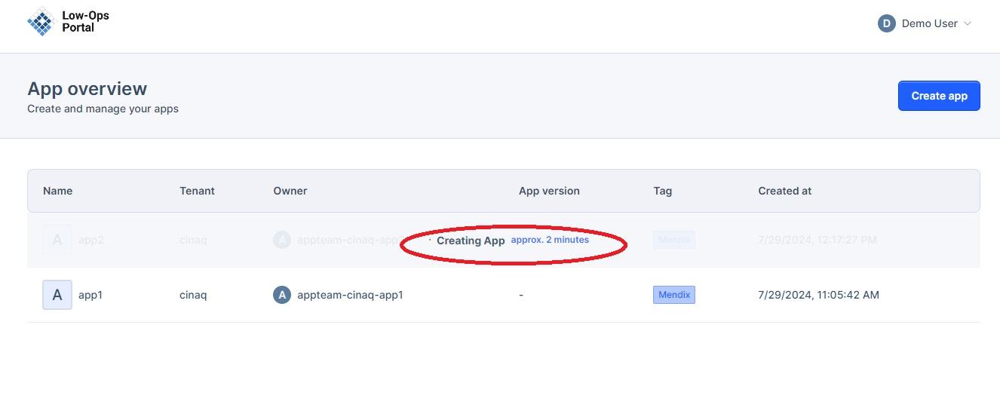
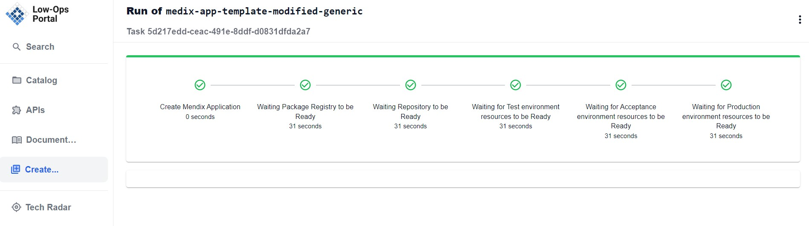

# Application Onboarding

This document provides instructions on how to log in to the Low-Ops portal and onboard a new application.

## Logging in to Low-Ops Portal

1. Navigate to the Low-Ops portal: https://portal.trial.low-ops.com/
2. Click on the "Log in with SSO" button.

3. Enter your username/email and password.

4. Click on the "Log in" button.
5. Once logged in, you will be redirected to the Low-Ops portal.

## Creating a New Application

1. On the home page, click on the "Create app" button.

2. In the pop-up window, fill in the fields for "App name" and "App tenant".
3. Click on the "Create app" button.

4. Wait for the application to be created. This process may take a few minutes.

5. Once the application is created, it will appear in the list of apps on the home page.

> **Note:** Allow a couple of minutes for the application to create.