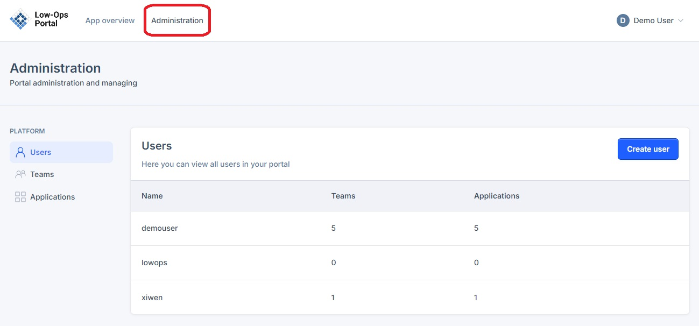
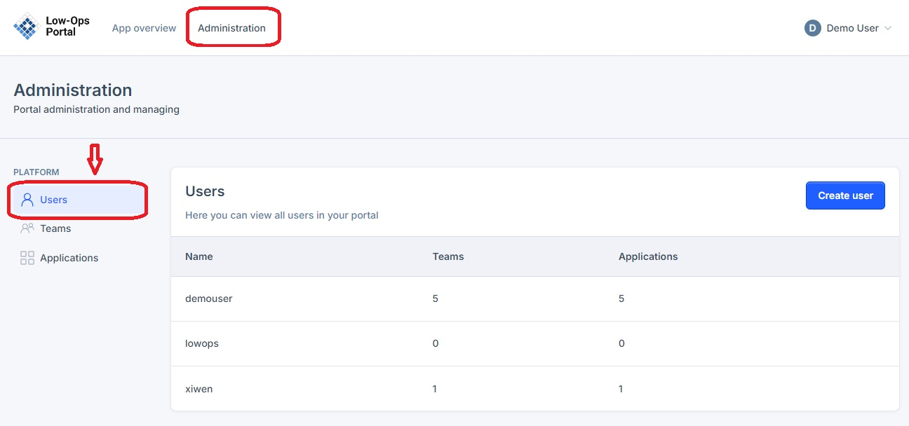
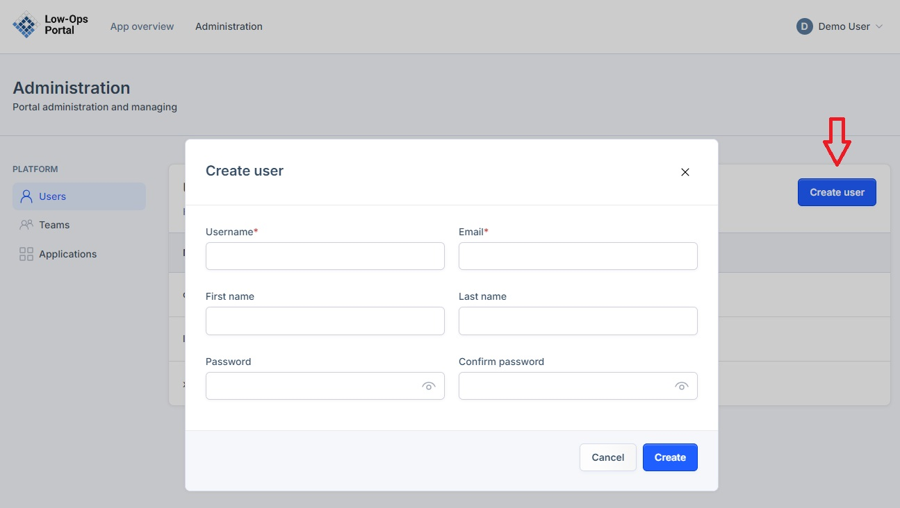
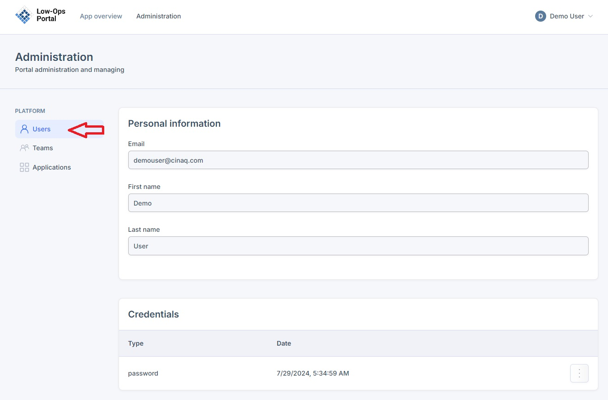
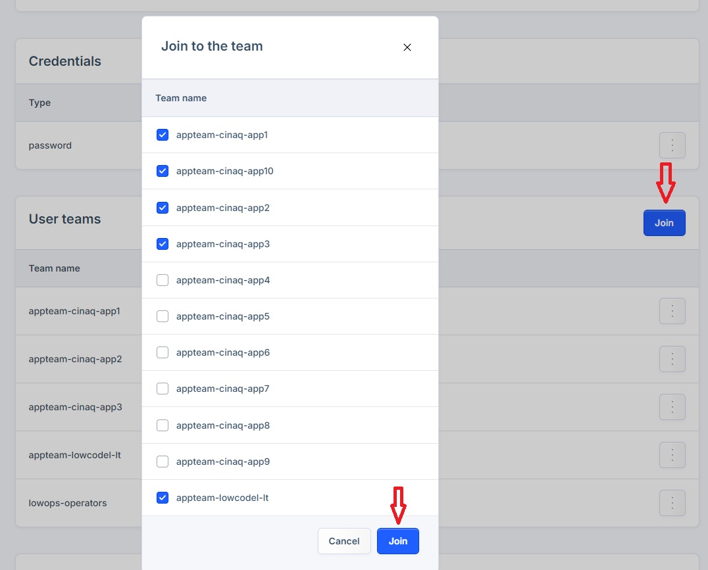
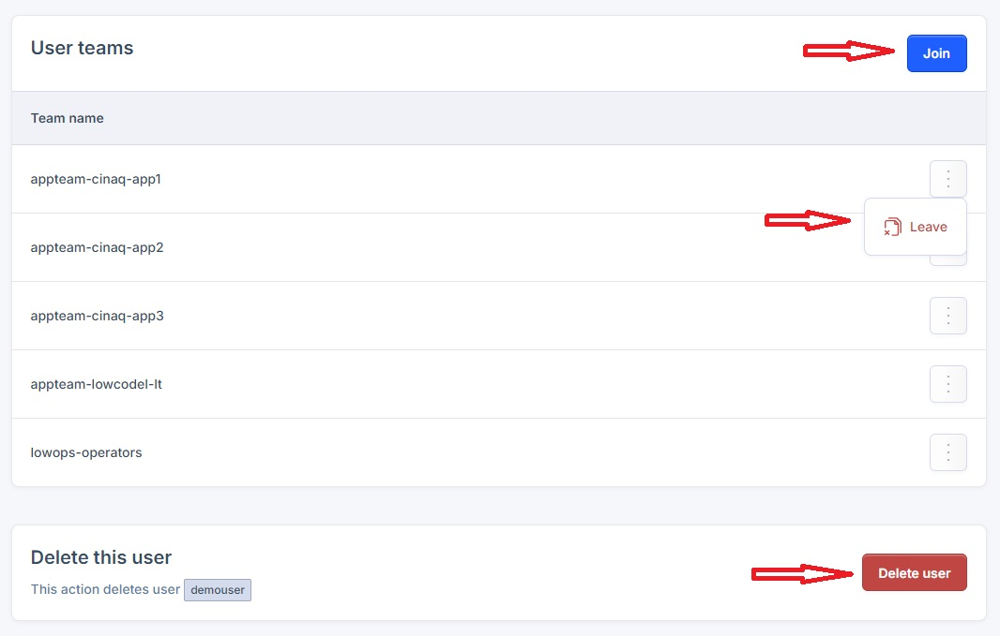
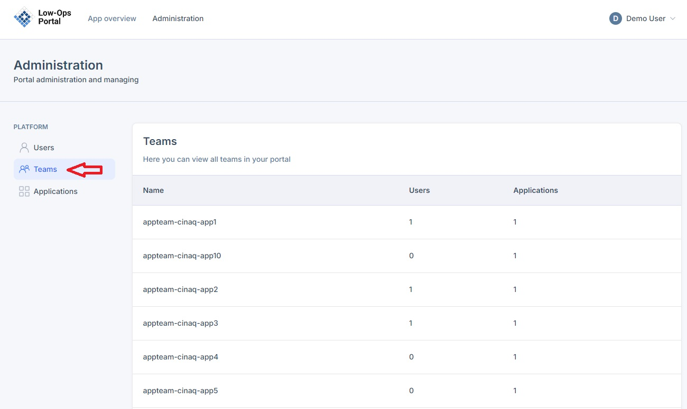
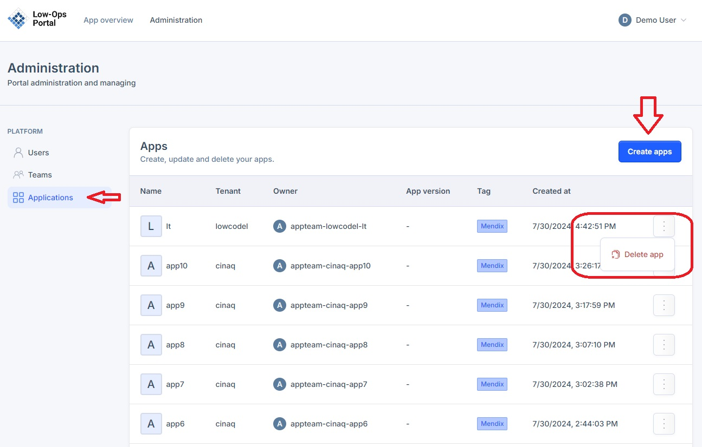

# Portal Administration

The Low-Ops Portal provides an administration interface for managing users, teams, and applications within the platform. From the Administration section, administrators can view all users in the portal, create new users, and manage application access. This centralized administration area allows for efficient user management and control over platform resources.

Login to the Low-Ops portal and navigate to the `Administration` tab in the left upper corner. 

## Create New User

1. To create a new user, navigate to the `Users` tab in the left side menu.

2. Click the `Create user` button. In the pop up window, input new user information and click the `Create` button. 

3. Once the user is created, it will appear in the list of users. 

4. Click on the user to open the profile. 

From here you can view: 
- Personal information
- Credentials section with a possibility to delete the password. 
- User teams section which allows to add user to different applications. To add a user to a new group, simply click the `Join` button. In the pop up window, put a check mark next to the group you want to add this user to. 

- Delete user.  

## Teams Section

Here you can view all teams in your portal.

## Applications Section

The `Applications` section allows to create new apps by clicking the `Create apps` button. 
To delete the app, click on the three dots to open a `Delete app` button. 

