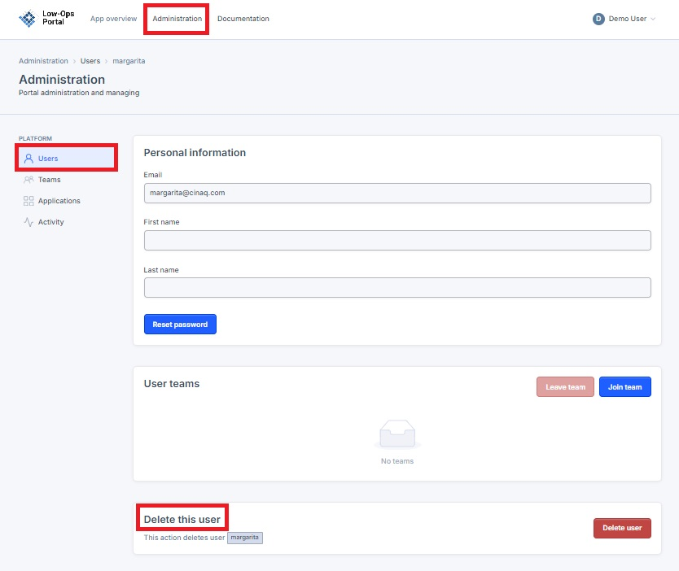
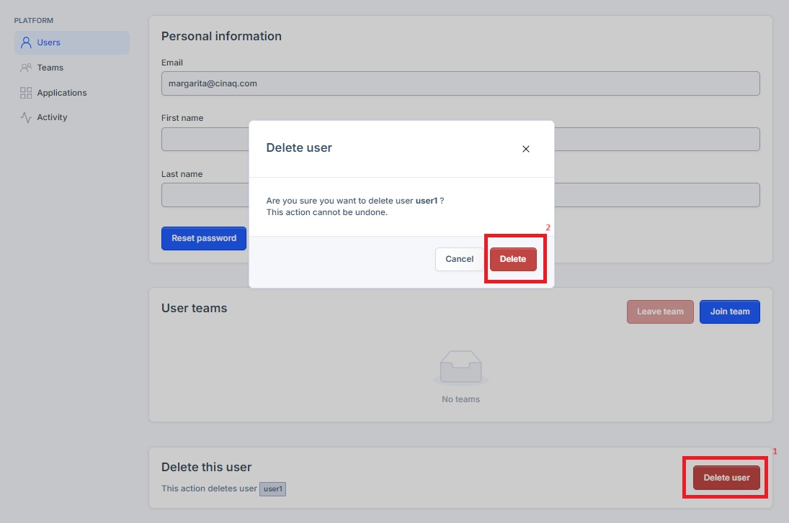

# Deleting a User

This guide provides step-by-step instructions for deleting a user in the Administration section.

## Steps to Delete a User

1. Navigate to the "Administration" tab in the upper left corner of the Low-Ops Portal.

2. In the left menu, select the "Users" tab.
3. Click on the user you want to delete to open their profile.
4. Scroll to the bottom of the page to the "Delete this user" section.

5. Click the "Delete user" button.
6. In the pop-up window, click the "Delete" button to confirm the deletion.

> **Warning:** Deleting a user is irreversible. Ensure you want to permanently remove the user before confirming.