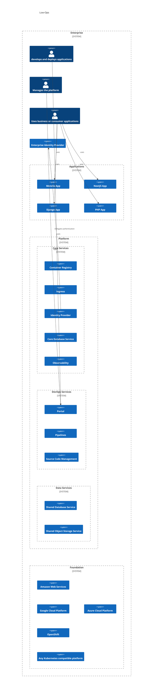

# High Level Architecture

Low-Ops is made up of a set of components that work together to provide a platform for running applications. 

## Overview

There are 3 main layers in Low-Ops architecture:

1. Applications - Custom-built applications that run on Low-Ops.
2. Platform - The platform that runs the applications. It also provides a diverse set of services that are used by the applications or enables developers to build, deliver, and own their applications end-to-end.
3. Foundation - The foundation that the platform runs on. This is the cloud provider or on-premise datacenter that provides a cloud-agnostic foundation which must be a Kubernetes cluster.

## Philosophy

Deploying components onto Kubernetes is not rocket science. However, having the platform to be reproducible, scalable, and maintainable is a challenge. Low-Ops is designed to be easy to use and requires minimal maintenance. It is designed to be used by developers and operators with minimal knowledge of Kubernetes and cloud infrastructure. You will be able to do all your tasks through the Low-Ops Portal supported with best practices of delivering applications to your business and customers.

Because the whole platform is fully automated and runs on your infrastructure, you have 100% control over your data and can be sure that it is secure. You can also easily integrate it with your existing systems and processes.

Don't want or need upgradability of Low-Ops? You can modify it to fit your needs. You can also use it as a starting point for your own platform.