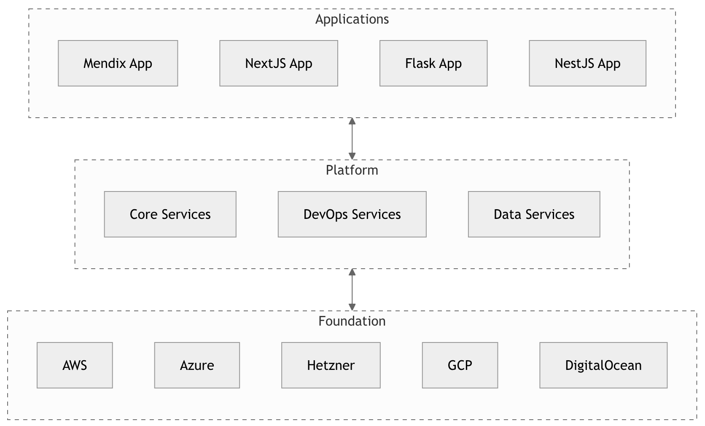
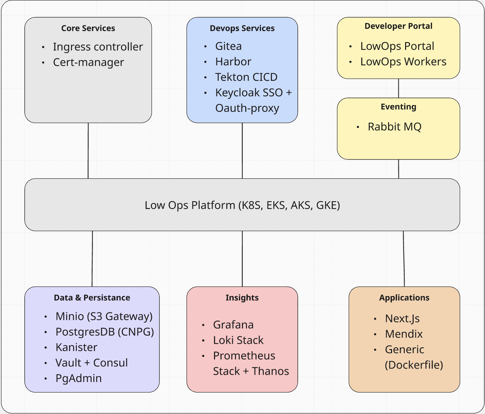

# High Level Architecture

Low-Ops is made up of a set of components that work together to provide a platform for running applications. 

## Overview

There are 3 main layers in Low-Ops architecture:

1. Applications - Custom-built applications that run on Low-Ops.
2. Platform - The platform that runs the applications. It also provides a diverse set of services that are used by the applications or enables developers to build, deliver, and own their applications end-to-end.
3. Foundation - The foundation that the platform runs on. This is the cloud provider or on-premise datacenter that provides a cloud-agnostic foundation which must be a Kubernetes cluster.

## Philosophy

Deploying components onto Kubernetes is not rocket science. However, having the platform to be reproducible, scalable, and maintainable is a challenge. Low-Ops is designed to be easy to use and requires minimal maintenance. It is designed to be used by developers and operators with minimal knowledge of Kubernetes and cloud infrastructure. You will be able to do all your tasks through the Low-Ops Portal supported with best practices of delivering applications to your business and customers.

Because the whole platform is fully automated and runs on your infrastructure, you have 100% control over your data and can be sure that it is secure. You can also easily integrate it with your existing systems and processes.

Don't want or need upgradability of Low-Ops? You can modify it to fit your needs. You can also use it as a starting point for your own platform.

LowOps is a modular, Kubernetes-based application platform that enables teams to deploy and manage a wide variety of applications - including low-code Mendix apps and generic Docker-based workloads - in a secure, observable, and scalable way. It is designed to work across multiple environments: single VM, cloud (AWS, Azure), and on-premises Kubernetes clusters.

## Core Components
1. Core Layer

Ingress: nginx ingress controller
Certificates: cert-manager with Let's Encrypt for automatic TLS

2. DevOps Toolchain

Git: Gitea for Git-based source control
CI/CD: Tekton pipelines for building, testing, deploying
Registry: Harbor with OCI scanning and MinIO backend
Auth: Keycloak as IdP + OAUTH-proxy for SSO-enabled services

3. Platform Portal

LowOps portal: Web UI for developers and operators
LowOps workers: Background automation tasks triggered via UI or events

4. Event-Driven Core

RabbitMQ: Event transport for platform events, deployments, monitoring

5. Data Layer

S3 storage: MinIO in S3 Gateway mode (Azure Blob / AWS S3 backends)
Databases: CNPG clusters (CloudNativePG) for apps and internal services
In production: Can integrate with Azure DB or AWS RDS
Backups: Kanister for Kubernetes-native backups
Secrets & config: Vault for secret management, Consul for service discovery
pgAdmin: DB UI for internal or debug usage

6. Monitoring & Observability

Metrics: Prometheus-stack + Thanos for HA + long-term metrics
Logs: Loki-stack for log aggregation
Dashboards: Grafana with prebuilt and custom dashboards

7. Developer Experience
Interaction point: All developers use the LowOps portal (SSO protected) to:
- Create applications
- Monitor deployments
- Access logs, metrics, backups
- Trigger builds and promotions
Supported app types:
- Generic: Any app using a Dockerfile (e.g., Django, Go, Node.js)
- Mendix: Fully supported, with deployment automation and CI/CD integration
- Next.js: Treated as a dedicated framework due to frontend-specific workflows

7. Multi-Tenancy & Isolation
Namespace per app environment: Each application has isolated namespaces for each environment
Access control: Managed via Keycloak SSO + Kubernetes RBAC
Registry and S3 storage: Support project-based access segregation (Harbor projects, S3 buckets)
