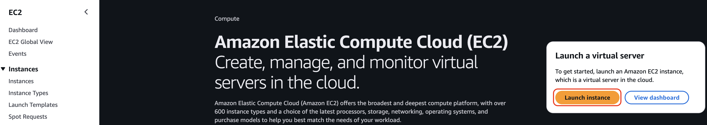
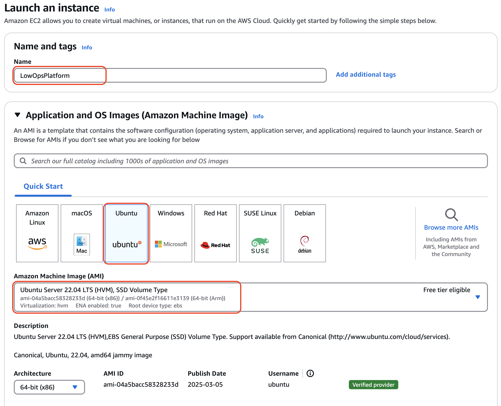
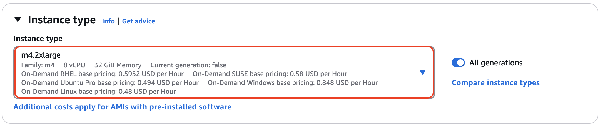
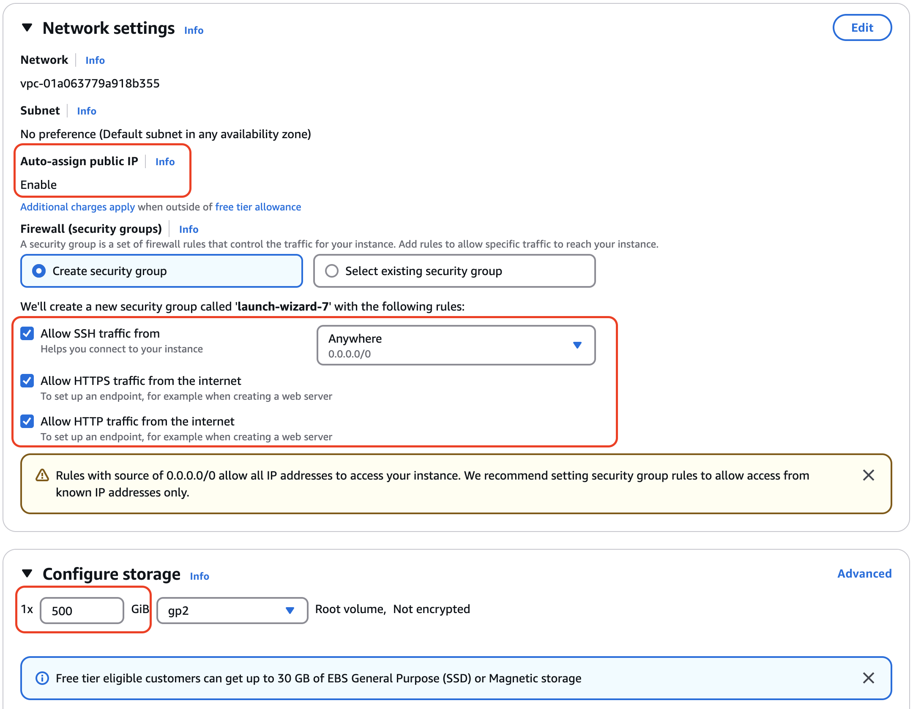
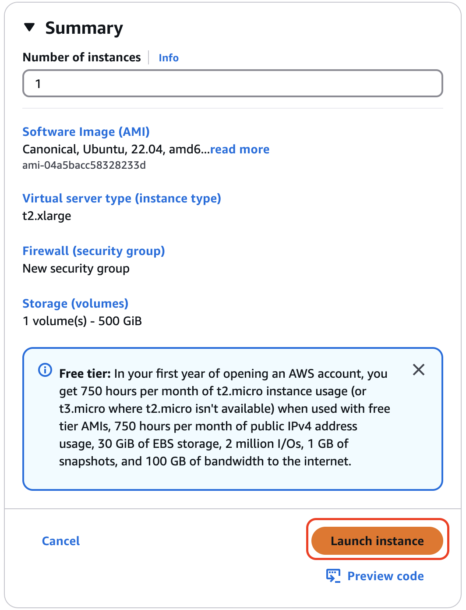

# AWS Single node installation

## Overview
This guide describes how to install the LowOps platform on a single AWS EC2 instance. This setup is suitable for testing and development environments. For production use, we recommend using a multi-node setup with proper high availability.

## Prerequisites
- AWS Console access with permissions to create EC2 instances and security groups
- Available domain name with DNS management access
- Minimum system requirements:
  - RAM: 16 GB
  - CPU: 8 vCPUs
  - Disk: 500 GB
  - Ubuntu 22.04 LTS

## Installation steps

### 1. Create EC2 instance
1. Log in to AWS Console
2. Navigate to EC2 Dashboard
3. Click `Launch Instance`

    

4. Configure instance `Name` and `OS AMI type` (Tested on Ubuntu 22.04)

    

5. Select instance type (Minimum resources required: 8vCPU, 16GB RAM)
   - Recommended: t3.2xlarge or similar
   - Make sure to enable T2/T3 unlimited for consistent performance

    

6. Configure Networking and Storage instance settings:
   - Network: Create a new VPC or use existing one
   - Security Group: Create new with following inbound rules:
     - SSH (22) from your IP
     - HTTP (80) from anywhere
     - HTTPS (443) from anywhere
   - Storage: 500 GB GP3 volume for root
   - Tags: Add appropriate tags for resource management

    

7. Launch server.

    

### 2. Configure DNS record
1. Configure wildcard `A` record pointing to server public IP address within DNS provider of your choice.
   - Example: If your domain is `paas.company.com`, create an `A` record for `*.paas.company.com` pointing to your EC2 instance's public IP
   - Wait for DNS propagation (can take up to 48 hours, but usually much faster)

### 3. Install LowOps Platform
1. SSH into your EC2 instance:
   ```bash
   ssh -i your-key.pem ubuntu@your-ec2-public-ip
   ```

2. Run command to start platform installation:
   ```bash
   curl -sO https://raw.githubusercontent.com/cinaq/helm-charts/refs/heads/main/charts/lowops-platform/scripts/install-platform.sh && chmod +x install-platform.sh && ./install-platform.sh
   ```

3. During installation process you will be prompted to input:
   - `base domain name` (For instance if your portal should be available at `portal.paas.company.com`. Base domain is `paas.company.com`)
   - Docker registry credentials. Current dockerhub pull image limits requires at list pro plan PAT for successfull installation.

4. Wait until `lowops-platform` pod in `lowops-devops` namespace status is `Completed`. Usually takes 20-30 minutes.

5. After installation completes, you can access the platform portal using the credentials from the script output.

### 4. Post-Installation
- Access the platform portal at `https://portal.your.domain.com`
- Start using platform [Platform Administration](../administration/applications/onboard.md)