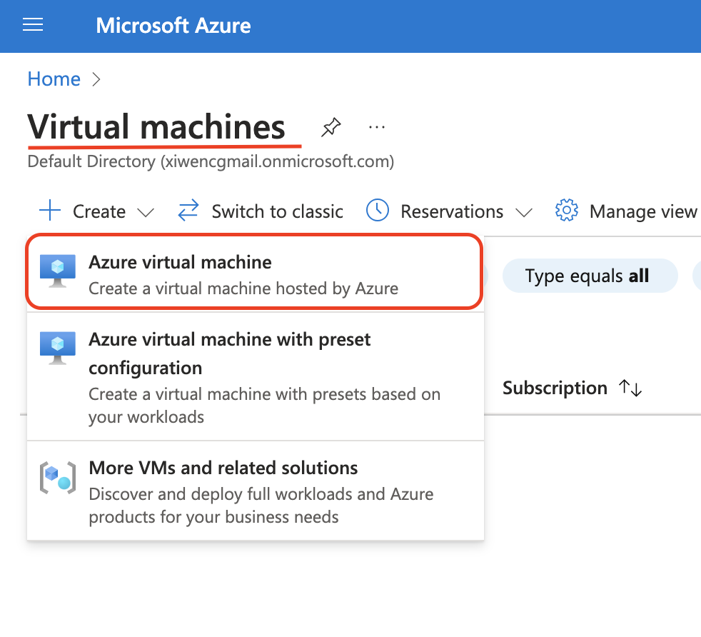
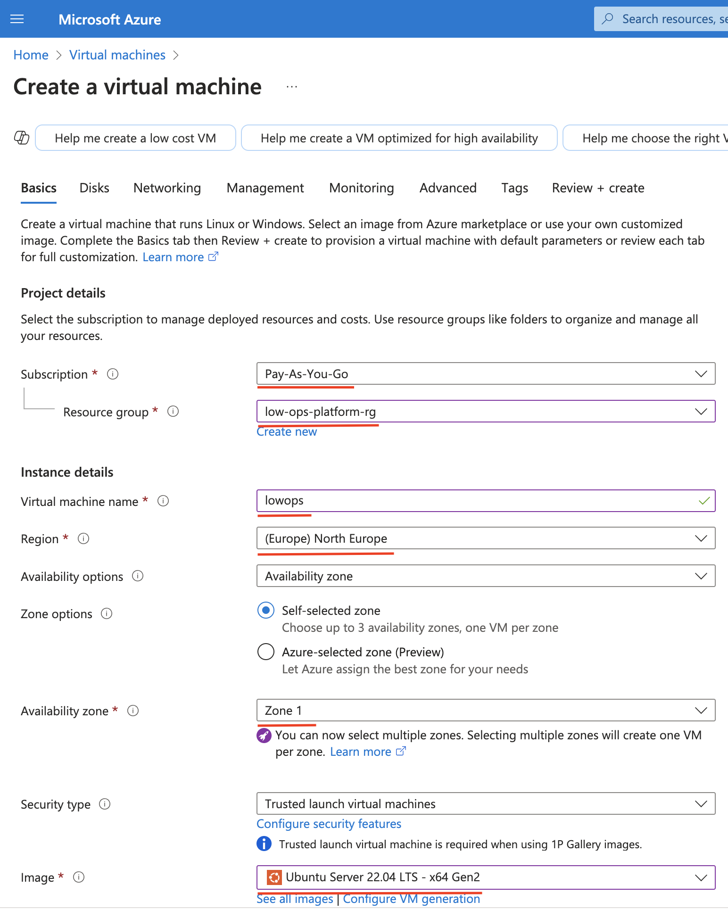
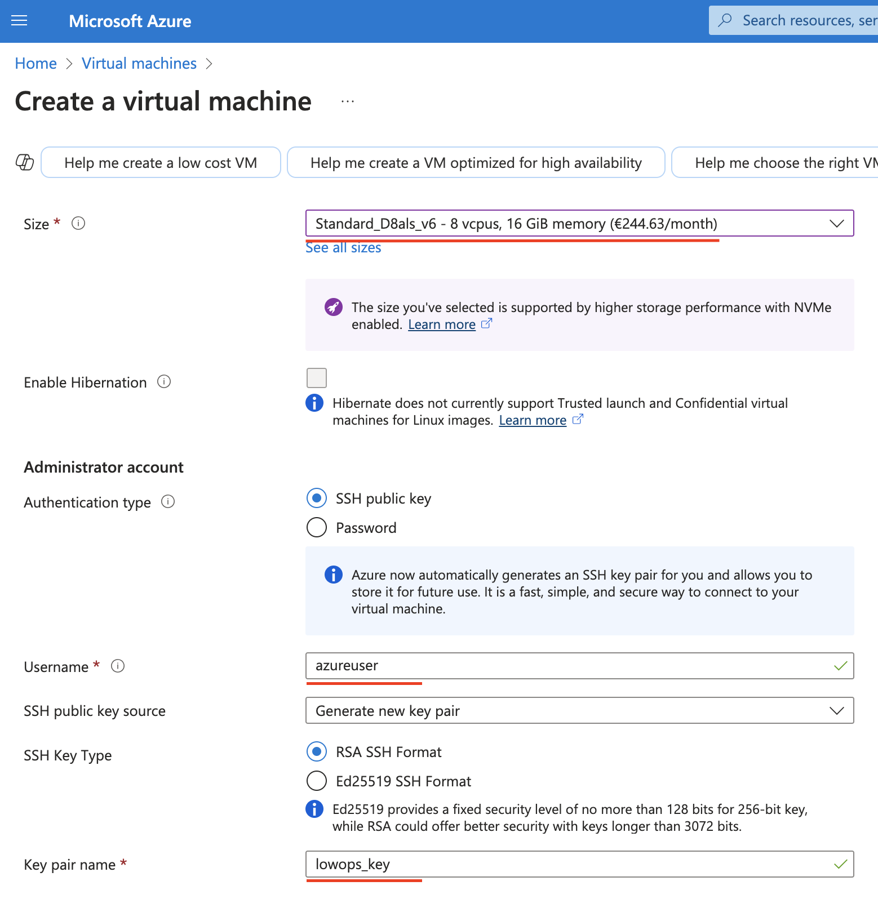
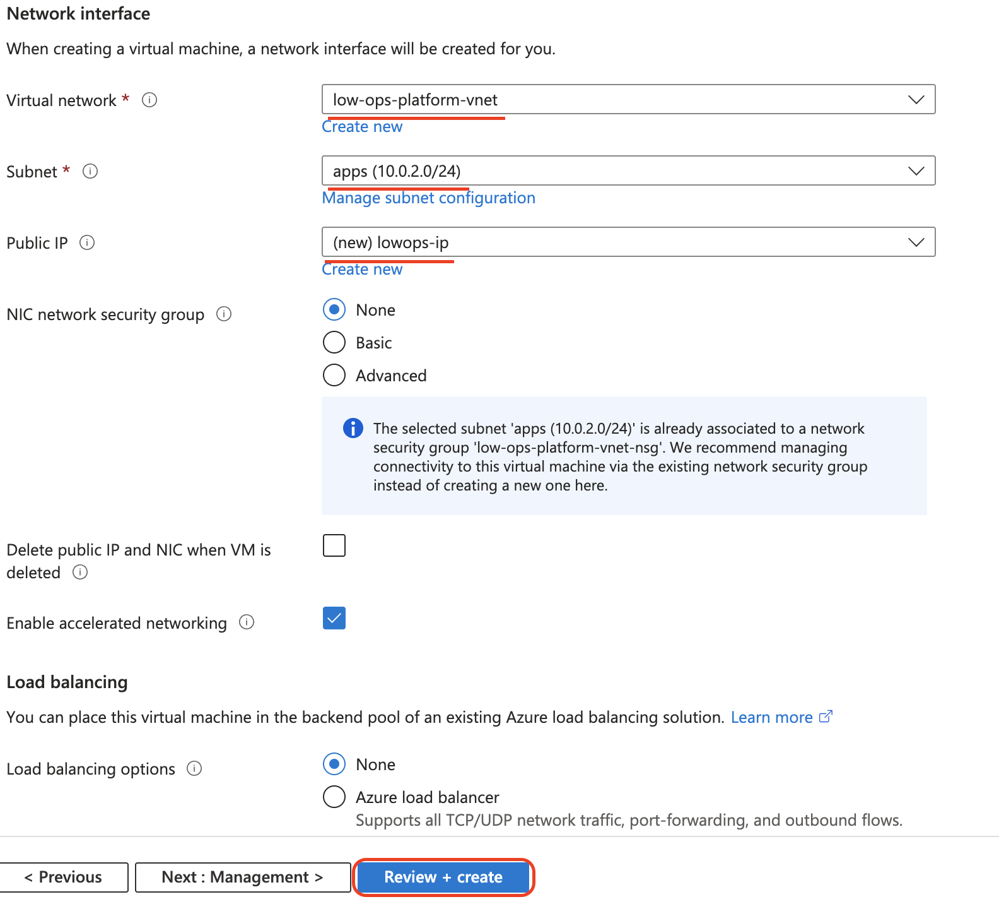
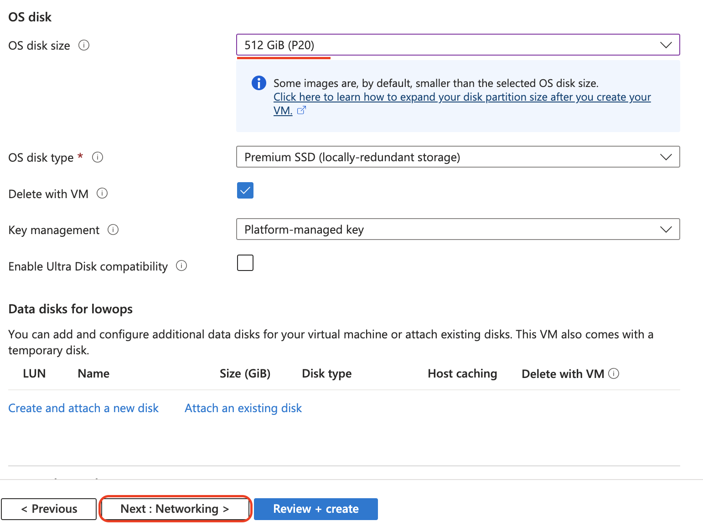
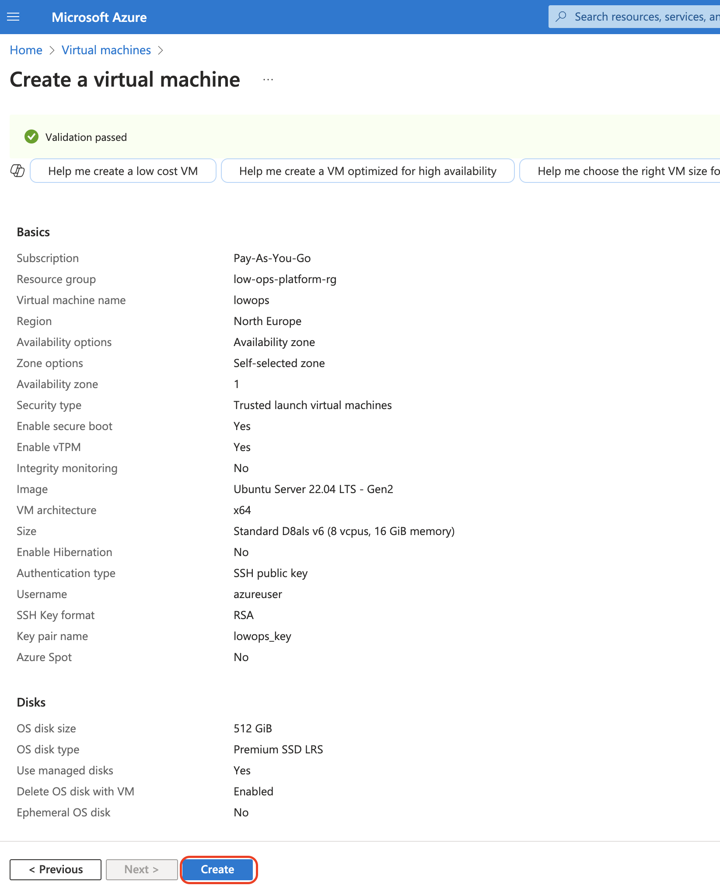

# Azure Single node installation

## Overview
This guide describes how to install the LowOps platform on a single Azure Virtual Machine. This setup is suitable for testing and development environments. For production use, we recommend using a multi-node setup with proper high availability.

## Prerequisites
- Azure Portal access with permissions to create Virtual Machines and Network Security Groups
- Available domain name with DNS management access
- Minimum system requirements:
  - RAM: 16 GB
  - CPU: 8 vCPUs
  - Disk: 500 GB
  - Ubuntu 22.04 LTS

## Installation steps

### 1. Create Azure Virtual Machine
1. Log in to Azure Portal
2. Navigate to Virtual Machines
3. Click `Create` and select `Azure virtual machine`

   

4. Configure basic settings:
   - Subscription: Select your subscription
   - Resource group: Create new or select existing
   - Virtual machine name: Enter a name
   - Region: Select your preferred region
   - Image: Ubuntu Server 22.04 LTS
   - Size: Select a VM size with minimum 8 vCPUs and 16GB RAM (e.g., Standard_D8s_v3)

   

5. Configure Administrator account:
   - Authentication type: SSH public key
   - Username: azureuser
   - SSH public key source: Generate new key pair or use existing

   

6. Configure networking:
   - Virtual network: Create new or select existing
   - Subnet: Create new or select existing
   - Public IP: Yes
   - NIC network security group: Advanced
   - Configure network security group with following inbound rules:
     - SSH (22) from your IP
     - HTTP (80) from anywhere
     - HTTPS (443) from anywhere

   

7. Configure storage:
   - OS disk type: Premium SSD
   - OS disk size: 500 GB

   

8. Review and create the VM

   

### 2. Configure DNS record
1. Configure wildcard `A` record pointing to VM public IP address within DNS provider of your choice.
   - Example: If your domain is `paas.company.com`, create an `A` record for `*.paas.company.com` pointing to your VM's public IP
   - Wait for DNS propagation (can take up to 48 hours, but usually much faster)

### 3. Install LowOps Platform
1. SSH into your Azure VM:
   ```bash
   ssh azureuser@your-vm-public-ip
   ```

2. Run command to start platform installation:
   ```bash
   curl -sO https://raw.githubusercontent.com/cinaq/helm-charts/refs/heads/main/charts/lowops-platform/scripts/install-platform.sh && chmod +x install-platform.sh && ./install-platform.sh
   ```

3. During installation process you will be prompted to input:
   - `base domain name` (For instance if your portal should be available at `portal.paas.company.com`. Base domain is `paas.company.com`)
   - Docker registry credentials. Current dockerhub pull image limits requires at list pro plan PAT for successfull installation.

4. Wait until `lowops-platform` pod in `lowops-devops` namespace status is `Completed`. Usually takes 20-30 minutes.

5. After installation completes, you can access the platform portal using the credentials from the script output.

### 4. Post-Installation
- Access the platform portal at `https://portal.paas.company.com`
- Start using platform [Platform Administration](../administration/applications/onboard.md)